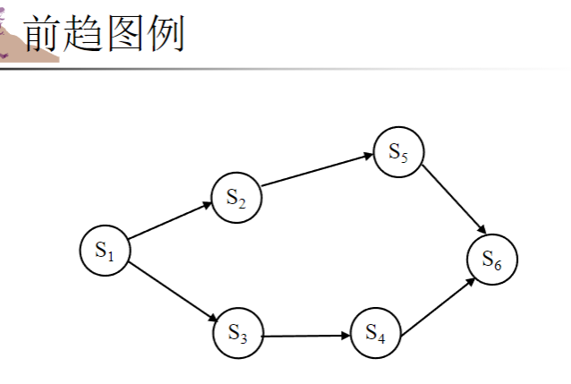
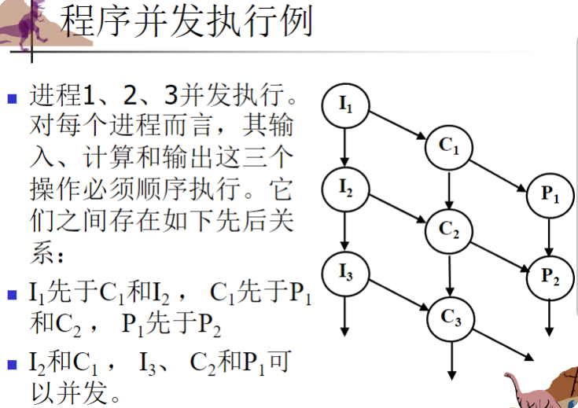

# 第3章：进程 - 知识梳理

## 3.1 进程的概念

### 进程的定义与引入

* **进程的引入** ：为了描述并发程序执行时的特征
* **进程的作用** ：是资源分配的基本单位，也是独立运行的基本单位
* **多种定义** ：
* 进程是程序在处理器上的一次执行过程
* 进程是可以和别的计算并行执行的计算
* 进程是程序在一个数据集合上运行的过程，是系统进行资源分配和调度的一个独立单位
* 进程是一个具有一定功能的程序关于某个数据集合的一次运行活动

### 前趋图

* **定义** ：前趋图是一个有向无循环图，用于描述程序、程序段或语句执行的先后次序
* **表示方法** ：
* 结点：表示一条语句、一个程序段或一个进程
* 有向边：表示前趋关系"→"
* 若(Pi，Pj)∈→，可写成Pi→Pj，则Pi是Pj的直接前趋，Pj是Pi的直接后继
* 初始结点：没有前趋的结点
* 终止结点：没有后继的结点
* 图例：
* 

### 程序的顺序执行与并发执行

#### 顺序执行

* **定义** ：程序由若干个程序段组成，按照特定先后次序执行，前一个操作执行完后才执行后继操作
* **特征** ：
* **顺序性** ：处理机的操作严格按照程序所规定的顺序执行
* **封闭性** ：程序一旦开始运行，其执行结果不受外界因素影响
* **可再现性** ：只要初始条件和执行环境相同，程序重复执行时结果相同

#### 并发执行

* **定义** ：若干个程序（或程序段）同时在系统中运行，执行在时间上重叠
* **特征** ：
* **间断性** ：并发程序具有"执行-暂停-执行"的间断性活动规律
* **失去封闭性** ：多个程序共享系统资源，程序之间相互影响
* **不可再现性** ：在初始条件相同的情况下，程序的执行结果依赖于执行的次序

### 与时间有关的错误

* 并发执行可能出现与时间有关的错误
* 例如：两个进程同时访问并修改同一变量x

  ```
  进程1：r1=x; r1++; x=r1;进程2：r2=x; r2++; x=r2;
  ```

  * 如果x初始值为0，执行结束后x可能为1或2，取决于执行顺序

### 程序并发执行的条件（Bernstein条件）

* **读集R(Si)** ：语句Si执行期间要引用的变量集合
* **写集W(Si)** ：语句Si执行期间要改变的变量集合
* **Bernstein条件** ：要保证两个程序段并发执行不会产生与时间有关的错误，必须满足：
* R(Si)∩W(Sj)=∅ （Si读的变量不能被Sj写）
* R(Sj)∩W(Si)=∅ （Sj读的变量不能被Si写）
* W(Si)∩W(Sj)=∅ （Si和Sj不能同时写同一个变量）
* 实例：
* 

### 并发语句的描述方式

```
cobegin
  S1; S2; ... Sn;
coend
```

### 进程的组成

进程包括：

* **代码段** （text section）：包含程序代码
* **程序计数器和处理机寄存器内容** ：保存当前执行位置和状态
* **栈** （stack）：保存函数参数、返回地址、局部变量等
* **数据段** （data section）：保存全局变量等

### 进程的特征

* **动态性** ：进程是程序的一次执行过程
* **并发性** ：多个进程实体同时存在于内存中，能在一段时间内同时运行
* **独立性** ：在传统OS中，进程是独立运行的基本单位，也是系统分配资源和调度的基本单位
* **异步性** （制约性）：进程以各自独立的、不可预知的速度向前推进
* **结构性** ：进程实体由程序段、数据段及进程控制块组成（进程映像）

### 进程与程序的关系

* 进程是动态概念，程序是静态概念
* 进程是暂时的，程序是永久的
* 进程与程序的组成不同
* 进程与程序密切相关（一个程序可对应多个进程；一个进程可包括多个程序）
* 进程可以创建新进程，而程序不能形成新程序

## 3.1.2 进程状态

### 进程的基本状态

* **新建（New）** ：进程刚刚创建，但还未进入就绪队列
* **运行（Running）** ：进程获得必要的资源并正在处理机上执行
* **等待（Waiting）** ：也称阻塞（Blocked）或睡眠（Sleep）状态，进程因某事件暂时无法执行
* **就绪（Ready）** ：进程已获得除处理机以外的所有资源，一旦分配处理机就可立即执行
* **终止（Terminated）** ：进程正常或异常结束，但尚未被完全撤销

### 进程状态的转换

* **运行→就绪** ：时间片用完、高优先级进程就绪
* **运行→等待** ：等待某事件发生（如I/O完成）
* **等待→就绪** ：等待的事件发生
* **就绪→运行** ：调度程序选择该进程执行

### 挂起状态

* **挂起的原因** ：
* 系统故障或功能受到破坏
* 检查中间结果
* 资源不足
* 内存不足
* **引入的新状态** ：
* 活动就绪 → 挂起就绪
* 活动阻塞 → 挂起阻塞

### 因果变迁

指一个状态变化A的发生会引起另一个状态变化B的发生

## 3.1.3 进程控制块（PCB）

### PCB的定义与作用

* **定义** ：PCB是描述和管理进程的数据结构
* **作用** ：是进程实体的一部分，是操作系统感知进程存在的方式，也是进程存在的唯一标志

### PCB包含的内容

1. **进程标识符** ：唯一标识进程的标识符或整数
2. **进程当前状态** ：说明进程当前所处状态
3. **进程队列指针** ：用于记录PCB队列中下一个PCB的地址
4. **程序和数据地址** ：进程的程序和数据在内存或外存中的存放地址
5. **进程优先级** ：反映进程获得CPU的优先级别
6. **CPU现场保护区** ：CPU现场信息的存放区域（通用寄存器、程序计数器、程序状态字等）
7. **通信信息** ：进程与其他进程所发生的信息交换
8. **家族关系** ：指明本进程与家族的关系（如父子进程标识）
9. **资源清单** ：列出进程所需资源及当前已分配资源

## 3.2 进程调度

### 3.2.1 调度队列

* **作业队列** ：系统中所有进程的集合
* **就绪队列** ：内存中就绪并等待执行的所有进程的集合（通常用链表实现）
* **设备队列** ：等待某一I/O设备的进程队列

### 3.2.2 CPU调度

* **长程调度** （作业调度）：选择可以进入就绪队列的进程
* **短程调度** （CPU调度）：选择下一个执行并分配CPU的进程
* **中程调度** ：有的系统引入中程调度，主要管理挂起与激活

#### 进程类型

* **I/O型进程** ：花费I/O时间多于计算
* **CPU型进程** ：花费更多时间用于计算

### 3.2.3 上下文切换

* **定义** ：将CPU切换到另一个进程需要保存当前进程的状态并恢复另一个进程的状态
* **特点** ：上下文切换是一种开销，在切换时系统没有做有用的工作
* **影响因素** ：切换时间取决于硬件的支持

## 3.3 进程操作

### 操作系统内核

* **内核的组成** ：
* 中断
* 时钟管理
* 进程管理
* 存储器管理
* 设备管理

### 原语

* **定义** ：由若干条机器指令构成的，用以完成特定功能的一段程序，这段程序在执行期间不可分割

### 3.3.1 进程创建

#### 进程创建的特点

* 父进程可以创建子进程
* 子进程可以创建自己的子进程，形成进程树

#### 资源共享方式

* 父进程子进程共享所有资源
* 子进程共享父进程资源的子集
* 父进程和子进程无资源共享

#### 执行方式

* 父进程和子进程并发执行
* 父进程等待，直到子进程终止

#### 地址空间

* 子进程是父进程的复制品
* 子进程装入一个新程序

#### 创建原因

* 用户登录
* 作业调度
* OS服务
* 应用需要

#### 创建原语的主要功能

1. 向系统申请一个空闲PCB
2. 为新进程分配资源
3. 初始化新进程的PCB
4. 将新进程的PCB插入就绪队列

### 3.3.2 进程终止

#### 终止原因

* 进程执行完最后一条语句并使用exit()系统调用请求删除自身
* 父进程终止子进程的原因：
  * 子进程超量使用分配的资源
  * 赋予子进程的任务不再需要
  * 父进程退出

#### 级联终止

* 在某些系统中，当父进程终止时，不允许子进程继续执行
* 这种现象称为级联终止

#### 引起进程撤销的原因

* 正常结束
* 异常结束：超时、内存不足、地址越界、算术错、I/O故障、非法指令等
* 外界干预：操作员或系统干预，父进程请求

#### 撤消原语的主要功能

1. 从系统的PCB表中找到被撤消进程的PCB
2. 检查被撤消进程的状态，如果是执行状态则立即停止执行
3. 检查并撤消子孙进程
4. 回收资源并回收PCB

### 进程阻塞与唤醒

#### 引起阻塞和唤醒的事件

* 请求系统服务
* 启动某种操作并等待操作完成
* 等待合作进程的协同配合
* 系统进程无新工作可做

#### 阻塞原语的主要功能

1. 停止当前进程的执行
2. 保存CPU现场信息
3. 将进程状态改为阻塞，并插入到相应事件的等待队列
4. 转进程调度程序，选择新进程运行

#### 唤醒原语的主要功能

1. 将被唤醒进程从等待队列中移出
2. 将进程状态改为就绪，并插入就绪队列
3. 转进程调度或返回

#### 阻塞与唤醒的关系

* 进程由执行状态转变为阻塞状态是由进程自己调用阻塞原语完成的
* 进程由阻塞状态转变为就绪状态是由另一个发现者进程调用唤醒原语实现的

### 进程的挂起与激活

#### 挂起原语的主要功能

1. 查找PCB
2. 检查进程状态并改变
3. 如果进程被挂起前为执行状态，则调度新进程

#### 激活原语的主要功能

1. 查找PCB
2. 检查并改变进程状态
3. 如果进程激活后为活动就绪状态，可能需要进行调度

## 进程的组织

* **线性方式** ：将PCB顺序存放在一片连续内存中
* **链表方式** ：将同一状态的PCB组成一个链表
* **索引方式** ：将同一状态的进程归入一个索引表，由索引指向相应的PCB

## 3.4 进程间通信

### 进程通信的基本概念

* **独立进程** ：不能影响其他进程或被其他进程影响
* **协作进程** ：可能影响另一个进程的执行或被另一个进程执行影响

### 进程协作的优点

* 信息共享
* 加速运算
* 模块化
* 方便

### 进程通信的类型

* **低级进程通信** ：进程互斥与同步，信息量少且效率低（如P、V操作）
* **高级进程通信** ：以较高效率传送大量数据，分为三类：

1. 共享存储器系统
2. 消息传递系统
3. 管道通信系统或共享文件系统

## 3.5 IPC中的共享内存系统

### 生产者-消费者问题

* **定义** ：生产者进程生产信息供消费者进程消费
* **缓冲区类型** ：
* 无界缓冲（unbounded-buffer）
* 有界缓冲（bounded-buffer）

### 有界缓冲区实现

* 共享变量：buffer数组、in和out指针
* 生产者进程：生产项目并放入缓冲区
* 消费者进程：从缓冲区取出项目并消费

## 3.6 IPC中的消息传递系统

### 消息传递的基本概念

* **定义** ：提供一种机制允许进程不必通过共享地址空间来实现通信和同步
* **基本操作** ：
* send(message)：发送消息
* receive(message)：接收消息

### 实现方式

1. **通信方式** ：

* 直接通信
* 间接通信

1. **同步方式** ：

* 同步（阻塞）
* 异步（非阻塞）

1. **缓冲方式** ：

* 零容量（发送者必须等待接收者）
* 有限容量（如线路满则发送者必须等待）
* 无限容量（发送者不用等待）

### 直接通信

* **特点** ：需要明确指定通信的接收者和发送者
* **原语** ：
* send(P, message)：向进程P发送消息
* receive(Q, message)：接收来自进程Q的消息

### 消息缓冲通信

* **数据结构** ：

```
  struct message {  sender;  // 发送者进程标识符  size;    // 消息长度  text;    // 消息正文  next;    // 指向下一个消息缓冲区的指针}
```

* **PCB增加的内容** ：

```
  struct PCB {  mq;     // 消息队列队首指针  mutex;  // 消息队列互斥信号量  sm;     // 消息队列资源信号量}
```

### 间接通信

* **特点** ：通过邮箱或端口发送或接收消息
* **原语** ：
* send(A, message)：向邮箱A发送消息
* receive(A, message)：从邮箱A接收消息
* **操作系统提供的机制** ：
* 创建新的信箱
* 通过信箱发送和接收消息
* 删除信箱

### 同步方式

* **阻塞发送** ：发送进程阻塞，直到消息被接收
* **非阻塞发送** ：发送进程不阻塞，继续执行
* **阻塞接收** ：如果没有消息，接收进程阻塞直到有消息到达
* **非阻塞接收** ：接收进程不阻塞，放弃接收努力

 **常用组合方式** ：

1. 非阻塞发送、阻塞接收
2. 非阻塞发送、非阻塞接收
3. 阻塞发送、阻塞接收

## 3.7 管道通信

### 管道通信的基本概念

* **实现方式** ：基本上采用文件系统的原有机制
* **协调能力** ：
* 互斥：确保进程互斥读写管道
* 同步：处理管道空、满情况
* 存在：确定对方是否存在

### 管道通信的工作机制

* 管道被视为循环队列，按先进先出方式读写
* 读取时，out指针移动；写入时，in指针移动
* 当管道满或空时，需要进行同步处理

## 总结

进程是现代操作系统中的核心概念，它是程序执行的实例，也是资源分配的基本单位。本章重点介绍了进程的基本概念、状态、调度、操作以及进程间通信方式。理解这些概念对于理解操作系统的工作原理至关重要。

进程的生命周期从创建开始，经历就绪、运行、阻塞等状态，最终被终止。操作系统通过PCB来管理进程，通过各种调度算法决定哪个进程获得处理机资源。进程间通信机制（如共享内存、消息传递和管道）使进程之间能够协作完成复杂任务。
