# 第9章 内存管理

## 9.1 背景与基本概念

### 内存的基本概念

* **内存(Memory)** : 由很大一组字或字节组成，每个字或字节都有自己的地址
* **内存(即存储器、主存)分区** :
* **系统区** : 供操作系统使用
* **用户区** : 划分为一个或多个区域，供用户进程使用

### 存储器管理的功能

1. **存储空间的分配和回收**
2. **地址变换** : 将逻辑地址变换为物理地址
3. **存储保护** : 防止因用户程序错误破坏系统或其他用户
4. **存储扩充** : 在逻辑上为用户提供比实际内存更大的存储空间

补充：CPU能直接访问的存储器有主存、高速缓存和寄存器

### 地址绑定

地址绑定是指确定程序中指令和数据的内存地址，可以在以下几个阶段发生：

1. **编译时绑定(Compile time)** :

* 如果在编译时就知道程序会放在内存的哪个位置，编译器会直接生成绝对地址
* 程序必须放在指定的内存位置才能运行
* 如需放在其他位置，必须重新编译

1. **加载时绑定(Load time)** :

* 如果编译时不知道程序会放在哪，则生成可重定位代码
* 地址绑定推迟到程序加载到内存时

1. **执行时绑定(Execution time)** :

* 如果进程在执行时可能在内存中移动，则地址绑定推迟到运行时
* 需要硬件支持，如基址寄存器或映射表

### 程序的装入

程序装入内存的三种方式：

1. **绝对装入方式** :

* 编译时产生绝对地址的目标代码
* 装入程序按照装入模块中的地址将程序及数据装入内存，不做地址变换
* 适用于单道程序环境

1. **可重定位装入方式** :

* 编译时产生相对地址的目标代码
* 装入程序根据内存当时的使用情况，将装入模块装入到适当位置
* 装入时进行地址变换

1. **动态运行时装入方式** :

* 在程序执行过程中进行地址变换
* 需要硬件支持，可以实现部分装入

### 逻辑地址与物理地址

* **逻辑地址** : 由CPU产生的地址，用户编程使用的地址，又称为虚拟地址或相对地址
* **物理地址** : 内存单元所看到的地址，又称为绝对地址或实地址
* **逻辑地址空间** : 所有逻辑地址的集合，又称地址空间
* **物理地址空间** : 所有物理地址的集合，又称主存空间

### 地址变换（重定位）

地址变换是将逻辑地址转换为物理地址的过程：

1. **静态地址变换** :

* 地址变换在程序装入时一次完成，此后不再改变
* 不需硬件支持，但程序运行时不能在内存移动，需要连续存储空间

1. **动态地址变换** :

* 每次访问内存之前将要访问的程序地址转换成内存地址
* 需要硬件支持，支持非连续空间分配，可实现虚拟存储

### 内存管理单元(MMU)

* MMU是运行时将虚拟地址映射到物理地址的硬件设备
* 在MMU策略中，用户进程产生的地址在送交内存前都会加上重定位寄存器的值

### 程序链接

将编译或汇编得到的目标模块和所需的库函数装配成完整的装入模块：

1. **静态链接** :

* 在程序运行前，将各目标模块及所需库函数装配成一个完整的装入模块

1. **装入时动态链接** :

* 在装入内存时边装入边链接
* 便于软件版本修改、更新和模块共享

1. **运行时动态链接** :

* 将链接推迟到执行时
* 加快程序装入，节省内存

### 动态加载和动态链接

* **动态加载(Dynamic Loading)** :
* 子程序只有在被调用时才被加载
* 优点是未用到的子程序不会被加载
* **动态链接(Dynamic Linking)** :
* 链接被推迟到执行时
* 通过"存根"(stub)来定位合适的内存驻留库程序
* 存根用子程序地址来替代自己，并执行子进程

## 9.2 连续内存分配

### 内存保护

内存保护方法包括：

1. **界限寄存器法** :

* **上下界寄存器方法** : 存放作业存储空间的结束地址和开始地址

  * 要求：下界寄存器≤地址＜上界寄存器
* **基址限长寄存器方法** : 存放作业存储空间的起始地址及作业长度

  * 要求：逻辑地址不超过限长

  2.**存储保护键** :
* 为每个存储块分配一个保护键，为每个作业赋予一个保护键
* 当作业运行时，检查键是否匹配

  3.**环保护机制** :
* 处理器状态分为多个环，具有不同的存储访问特权级
* 低编号环具有高优先权
* 基本原则:

  * 程序可以访问驻留在相同环或较低特权环中的数据
  * 程序可以调用驻留在相同环或较高特权环中的服务

  4.**存取权限** :
* 禁止做任何操作
* 只能执行
* 只能读
* 读/写

### 9.2.1 单一分区分配

* 也称单一连续分配
* 内存分为系统区和用户区
* 优点：管理简单，只需很少的软硬件支持
* 缺点：各类资源的利用率不高

### 9.2.2 内存分配

内存分配的主要方式：

#### 1. 固定分区

* 内存空间划分为若干个固定大小的分区，每个分区装入一道程序
* 系统需要建立分区使用表记录各分区信息
* 分区分配：找出满足需求的空闲分区，修改状态
* 分区回收：释放占用的分区，将状态置为未分配
* 缺点：不能充分利用内存，存在内存碎片

#### 2. 动态分区

* 根据作业大小动态建立分区
* 分区大小和数目都是可变的
* 数据结构：
  * 空闲分区表
  * 空闲分区链

#### 分区分配算法

1. **首次适应算法(First-fit)** :

* 空闲分区按地址递增排序
* 从表首开始查找，找到第一个能满足要求的分区
* 优点：优先利用内存低地址端，高地址端有大空闲区
* 缺点：低地址端小空闲分区多时会增加查找开销

1. **循环首次适应算法(Next-fit)** :

* 从上次找到的空闲分区的下一个开始查找
* 特点：使存储空间利用更加均衡，但会使系统缺乏大的空闲分区

1. **最佳适应算法(Best-fit)** :

* 空闲分区按容量大小递增排序
* 找到第一个能满足要求的分区(最小的满足要求的分区)
* 优点：保留了大的空闲区
* 缺点：分割后的剩余空闲区很小，易产生难以利用的碎片

1. **最坏适应算法(Worst-fit)** :

* 空闲分区按容量大小递减排序
* 分配最大的空闲分区
* 特点：剩下的空闲区比较大，但当大作业到来时可能无法满足

  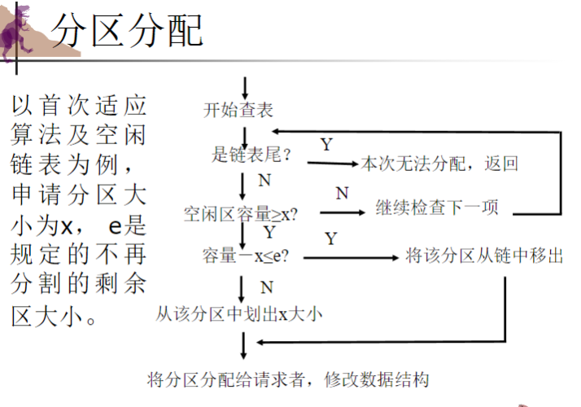
* 案例分析
* 
* 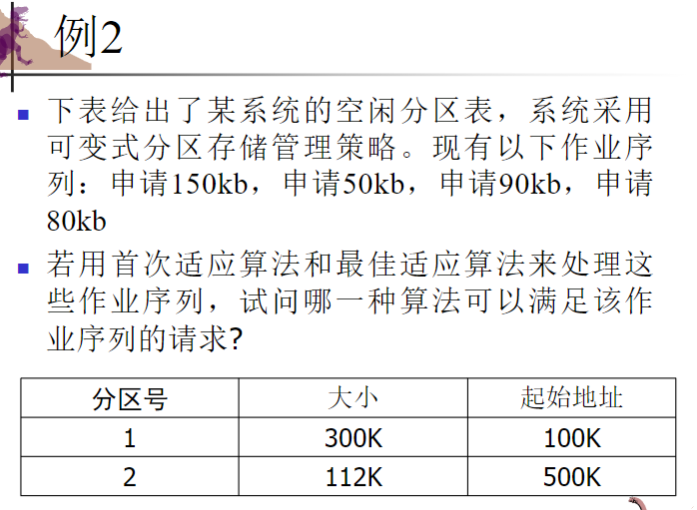

#### 分区回收

回收分区时，有四种情况：

1. 回收分区上面邻接一个空闲分区
2. 回收分区下面邻接一个空闲分区
3. 回收分区上下都邻接空闲分区
4. 回收分区不与任何空闲分区相邻

补充：

### 9.2.3 碎片

* **内部碎片** : 分配给作业的存储空间中未被利用的部分
* **外部碎片** : 系统中无法利用的小存储块

解决碎片问题的方法：

* **拼接(Compaction)** : 通过移动把多个分散的小分区拼接成一个大分区
* 拼接需要动态重定位技术支持，但会消耗大量处理机时间

补充：

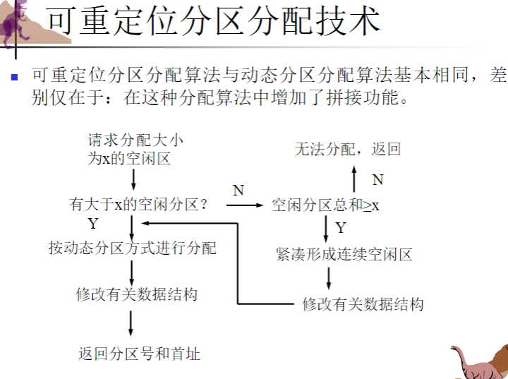

### 伙伴系统(Buddy System)

伙伴系统是一种实用的动态存储管理方法：

* **内存分配** :
* 初始时有大小为2^m的空间
* 当进程申请大小为n的空间(2^(i-1) < n ≤ 2^i)时，分配2^i大小的空间
* 如无合适的空闲块，则将大的空闲块对半划分，直到产生合适大小的块
* **内存回收** :
* 检查释放块的伙伴是否空闲，若空闲则合并
* 继续检查合并后的块是否有空闲伙伴，如有则再合并
* **伙伴地址公式** :
* 空闲块起始地址为d，长度为2^k
* 伙伴地址Buddy(k,d) =
  * d + 2^k，若d % 2^(k+1) = 0
  * d - 2^k，若d % 2^(k+1) = 2^k
* **优缺点** :
* 分配和回收时需要对伙伴进行分拆及合并
* 存在一定的内存浪费

案例分析：

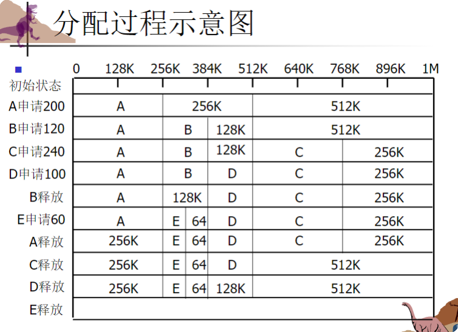

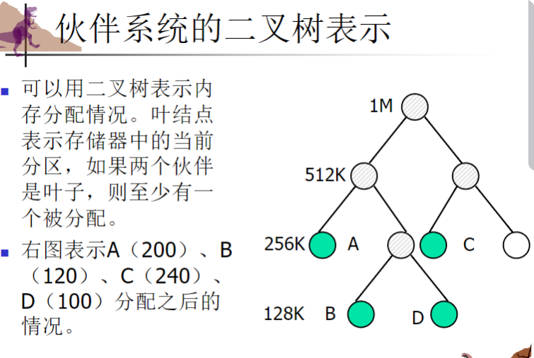

## 9.3 分页(Paging)

### 9.3.1 基本方法

分页是将物理内存和逻辑内存都分成固定大小的块：

* **帧(Frame)** : 物理内存中的固定大小的块
* **页(Page)** : 逻辑内存中的固定大小的块
* 分配时以块为单位，可以将进程的某一页放到任意一个空闲物理块中

分页的特点：

* 物理上不连续，逻辑上连续
* 存在内部碎片
* 页面大小通常为2的幂(512B到8KB之间)

### 逻辑地址结构

分页系统中，逻辑地址由页号(Page number)和页内位移(Page offset)组成：

* 页号 P = int(A/L)，其中A为逻辑地址，L为页面大小
* 页内位移 W = A % L

### 页表(Page Table)

* 记录每个页面对应的物理块号
* 每个进程有一个页表
* 通常存放在内存中
* 由页表寄存器指示页表的基址和长度

### 存储分块表

记录内存中各物理块使用情况：

* **位示图** : 用二进制位表示物理块状态(1表示已分配，0表示未分配)
* **空闲存储块链** : 将所有空闲存储块链接起来

补充：

### 9.3.2 硬件支持

#### 地址变换过程

1. 将逻辑地址分为页号和页内位移
2. 检查页号是否超过页表长度
3. 通过页表获取物理块号
4. 将物理块号和页内位移拼接形成物理地址
5. 如图所示：

   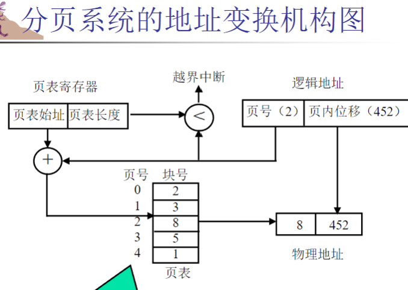
6. 案例如下：

   

   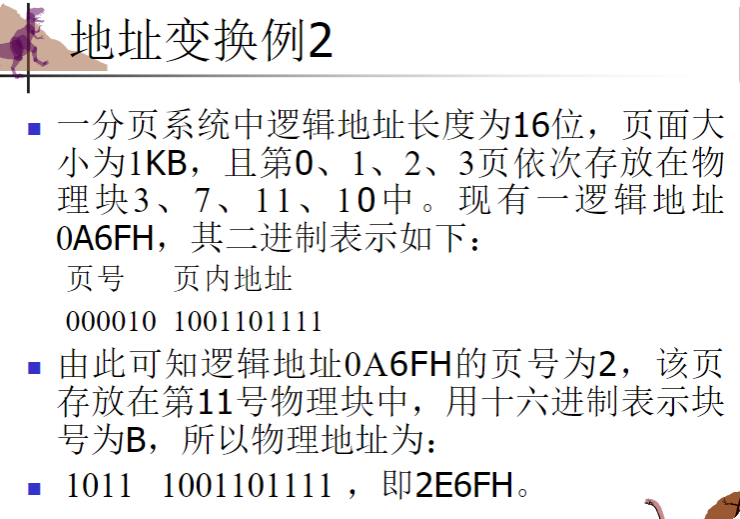

#### 快表(TLB)

* 又称联想存储器(associative memory)或转换后备缓冲区
* 存放当前访问的页表项
* 通过并行查找提高地址变换速度
* 如果页号在快表中，直接获取对应的物理块号
* 如果不在，则访问内存中的页表

  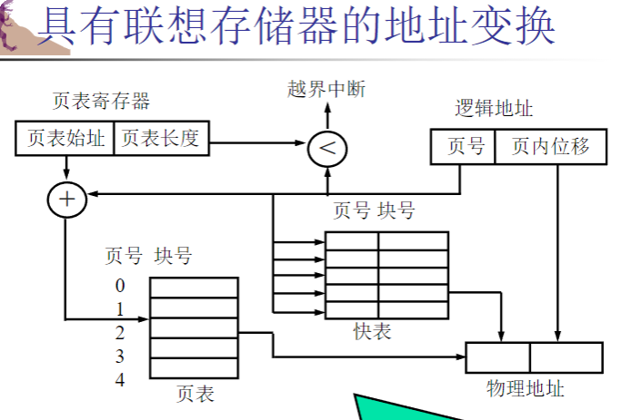

#### 有效访问时间计算

假设:

* 内存访问时间 m
* 快表查找时间 n
* 快表命中率 p
* 有效访问时间 EAT = p*(n+m) + (1-p)*(n+2m)

### 9.3.3 存储保护

* 通过与每个帧相关联的保护位实现
* 有效-无效位附在页表的每个表项中:
  * "valid": 页面在进程的逻辑地址空间中
  * "invalid": 页面不在进程的逻辑地址空间中
* 补充：

### 9.3.4 共享页

* 如果代码是可重入代码(纯代码)，则可以共享
* 通过使多个进程的页表项指向同一个物理块实现共享

补充：

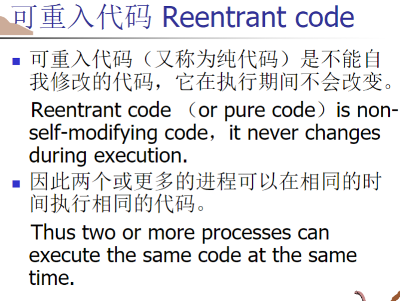

## 9.4 页表结构

### 9.4.1 分级页表

用于处理大的逻辑地址空间：

* 将页表再分页，使每页与内存物理块大小相同
* 对于32位逻辑地址，页大小4KB:
  * 一级页号(p1)：访问外部页表的索引
  * 二级页号(p2)：外部页表的偏移
  * 页内位移(d)：访问数据的偏移

优点：

* 不需要连续存放整个页表
* 只需要将当前需要的页表部分保存在内存中

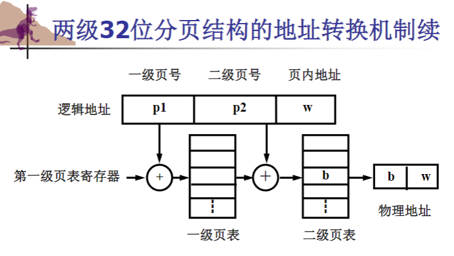

### 9.4.2 哈希页表

处理超过32位地址空间的方法：  

* 虚拟页号被散列到页表中
* 每个表项包含链表，处理散列冲突
* 算法：用虚拟页号查找哈希表，比较找到匹配的页号，获取对应的物理帧号

  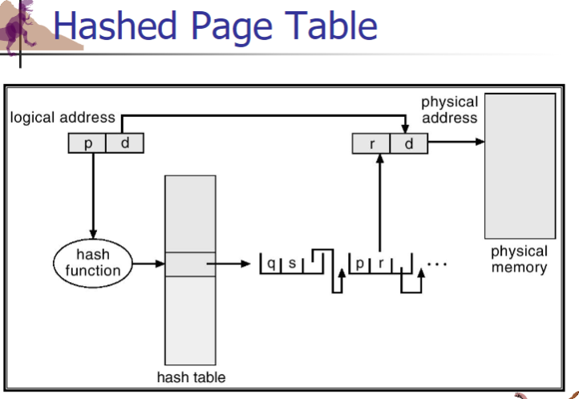

### 9.4.3 反向页表

解决页表占用大量空间的问题：

* 为每个物理块设置一个页表项
* 表项内容为页号及其隶属进程的标识号
* 通过进程标识号和页号检索反向页表

优缺点：

* 节省内存空间
* 查找速度较慢(需要遍历整个表)
* 解决方法：使用快表或散列函数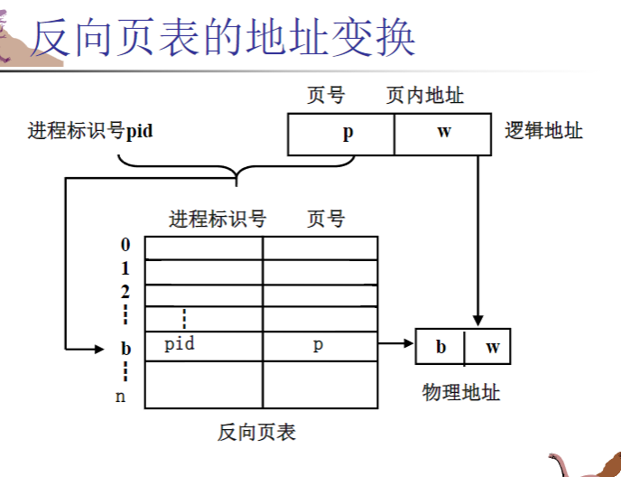

## 9.5 交换(Swapping)

* 将进程暂时从内存交换到备份存储，需要时再换回
* 用于释放内存给高优先级进程使用
* 也称为滚出、滚入(roll out, roll in)

### 覆盖与交换技术

#### 覆盖技术

* 将大程序划分为若干相对独立的程序单位(覆盖)
* 不需要同时装入内存的覆盖组成一个覆盖段
* 覆盖区的大小由段中最大的覆盖确定

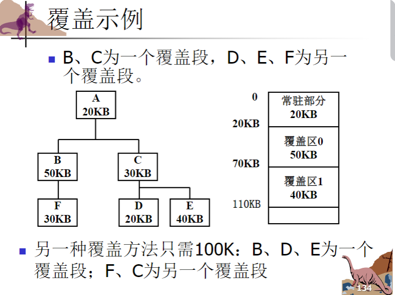

#### 交换技术

* 将内存中暂时不用的程序换出到外存
* 将已具备运行条件的程序或数据从外存换入内存

#### 覆盖与交换的比较

* 交换由操作系统自动完成，覆盖需要程序员参与
* 交换在不同作业之间进行，覆盖在同一作业内进行
* 覆盖主要用于早期系统，交换在现代系统中仍然重要

## 9.6 分段(Segmentation)

### 9.6.1 基本方法

分段是将程序划分为逻辑单位：

* 主程序、过程、函数、方法、对象等
* 每个段从0开始编址，分配连续的内存区域
* 各段之间不要求连续

### 分段系统的逻辑地址结构

* 由段号和段内位移组成
* 地址空间是二维的

### 9.6.2 硬件支持

#### 段表

* 记录每段在内存的起始地址和长度
* 一般存放在内存中
* 系统设置段表寄存器存放段表始址和段表长度

#### 地址变换过程

1. 检查段号是否超过段表长度
2. 通过段表获取段的起始地址
3. 检查段内地址是否超过段长
4. 将段的起始地址与段内位移相加得到物理地址

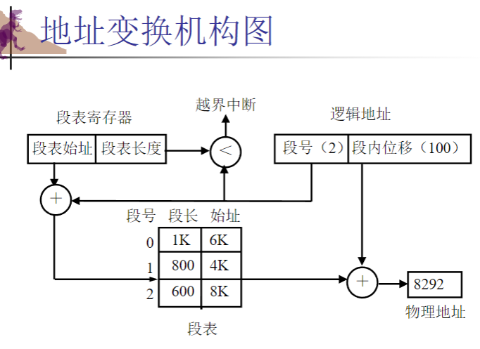

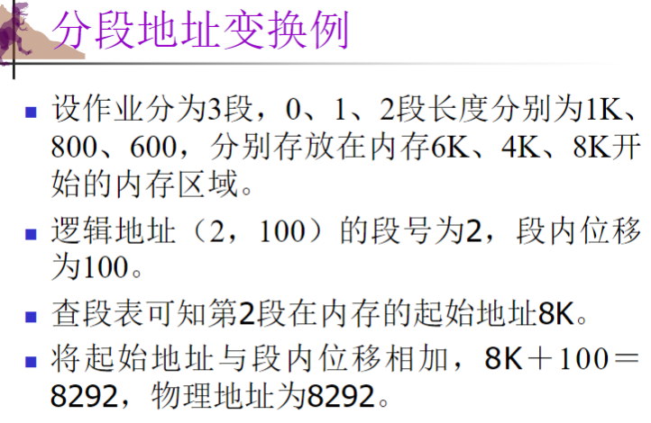

#### 分段保护

* 地址越界保护：检查段号与段表长度，段内位移与段长
* 存取控制保护：设置存取权限

### 分段与分页的区别

* 页是物理单位，段是逻辑单位
* 页大小固定，段长度可变
* 分页是一维地址空间，分段是二维地址空间

### 分段系统中的信息共享

* 通过使多个进程的段表项指向同一内存区域实现

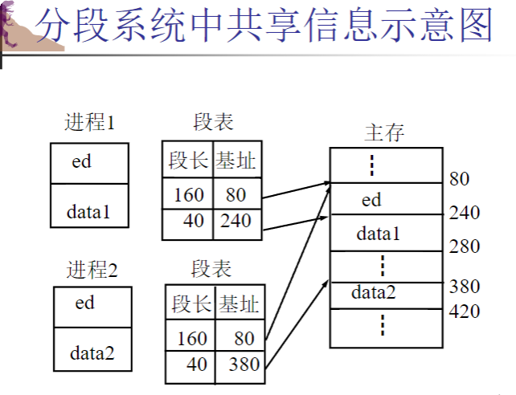

## 段页式存储管理

### 基本思想

* 先将地址空间分成若干逻辑段
* 再将每段分成若干页
* 主存分成与页面大小相同的物理块
* 分配以物理块为单位

### 地址结构

* 段号、段内页号、页内位移

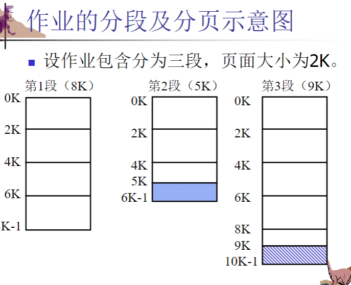

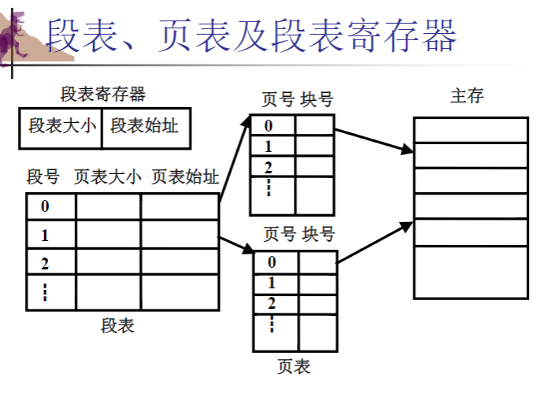

### 地址变换过程

1. 通过段号查找段表，获取段对应的页表
2. 通过段内页号查找页表，获取物理块号
3. 将物理块号与页内位移拼接形成物理地址

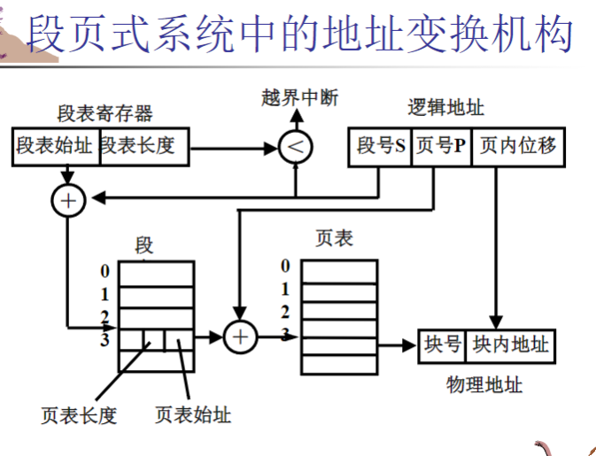

### 使用快表提高访问速度

* 在段页式系统中，访问信息需要三次内存访问：段表、页表、数据
* 使用快表可以减少内存访问次数

## 练习题解答

### 9.2 Why are page sizes always powers of 2?

 **答案** ：页面大小总是2的幂主要有以下几个原因：

1. 地址转换效率：当页面大小是2的幂时，可以使用位移操作快速计算页号和页内偏移。例如，若页面大小为2^k，则页号 = 地址 >> k，页内偏移 = 地址 & (2^k-1)。这种位操作比除法和取模运算快得多。
2. 内存对齐：计算机硬件通常按2的幂次方进行内存对齐，这与CPU的字长相关。
3. 简化硬件实现：当使用2的幂大小时，地址变换电路设计更简单高效。
4. 存储效率：操作系统中的许多数据结构也是按2的幂设计的，使用相同的大小可以提高内存利用效率。

### 9.4 Consider a logical address space of 64 pages of 1,024 words each, mapped onto a physical memory of 32 frames. a. How many bits are there in the logical address? b. How many bits are there in the physical address?

考虑一个64页的逻辑地址空间，每个页包含1 024个字，映射到32帧的物理内存上。a.逻辑地址有多少位？b.物理地址有多少位？

 **答案** ：
a. 逻辑地址的位数：

* 页数为64，需要log₂64 = 6位来表示页号
* 每页1024字，需要log₂1024 = 10位来表示页内偏移
* 总共需要6 + 10 = 16位

b. 物理地址的位数：

* 物理内存有32个帧，需要log₂32 = 5位来表示帧号
* 每帧大小与页面相同，为1024字，需要10位表示帧内偏移
* 总共需要5 + 10 = 15位

### 9.22 The MPV operating system is designed for embedded systems and has a 24-bit virtual address, a 20-bit physical address, and a 4-KB page size. How many entries are there in each of the following? a. A conventional, single-level page table b. An inverted page table What is the maximum amount of physical memory in the MPV operating system?

MPV操作系统是为嵌入式系统设计的，具有24位虚拟地址、20位物理地址和4 kb页面大小。下面每一项有多少项？a.常规的单级页表b.倒置页表MPV操作系统的最大物理内贮量是多少？

 **答案** ：
a. 常规单级页表的表项数：

* 页面大小为4KB = 2^12字节，因此页内偏移需要12位
* 虚拟地址为24位，所以页号需要24 - 12 = 12位
* 页表表项数为2^12 = 4,096个

b. 反向页表的表项数：

* 物理地址为20位，页面大小为2^12字节
* 物理内存中的帧数为2^(20-12) = 2^8 = 256个
* 反向页表的表项数为256个

MPV操作系统的最大物理内存：

* 物理地址为20位，能够寻址2^20 = 1,048,576字节 = 1MB

### 9.25 Consider a paging system with the page table stored in memory. a. If a memory reference takes 50 nanoseconds, how long does a paged memory reference take? b. If we add TLBs, and if 75 percent of all page-table references are found in the TLBs, what is the effective memory reference time? (Assume that finding a page-table entry in the TLBs takes 2 nanoseconds, if the entry is present.)

考虑一个页面表存储在内存中的分页系统。a.如果一个内存引用需要50纳秒，那么一个分页内存引用需要多长时间？b.如果我们添加tlb，并且75%的页表引用都在tlb中，那么有效内存引用时间是多少？（假设在TLBs中找到一个页表条目需要2纳秒，如果该条目存在的话）。

 **答案** ：
a. 分页系统中的内存访问时间：

* 一次内存访问需要50纳秒
* 分页系统中，每次数据访问需要两次内存访问：一次访问页表，一次访问数据
* 总时间 = 50 + 50 = 100纳秒

b. 使用TLB后的有效访问时间：

* TLB命中时间 = 2纳秒 + 50纳秒(数据访问) = 52纳秒
* TLB未命中时间 = 2纳秒 + 50纳秒(页表访问) + 50纳秒(数据访问) = 102纳秒
* TLB命中率为75%
* 有效访问时间 = 0.75 × 52 + 0.25 × 102 = 39 + 25.5 = 64.5纳秒

## 选择题答案

### 选择题1

1. 首次适应算法的空白区是 _____ 。
   * A. 按大小递减顺序连在一起
   * B. 按地址由大到小排列
   * C. 按地址由小到大排列
   * D. 按大小递增顺序连在一起

 **答案** : C
 **解析** : 首次适应算法要求空闲分区按地址递增的次序排列，从空闲分区表首开始查找，直到找到第一个能满足要求的空闲分区。

2. 在分区存储管理中的拼接技术可以 _____ 。
   * A. 缩短访问周期
   * B. 增加内存容量
   * C. 集中空闲区
   * D. 加速地址转换

 **答案** : C
 **解析** : 拼接技术通过移动内存中的程序，将多个分散的小分区拼接成一个大分区，从而集中空闲区。

### 选择题2

1. 采用 _____ 不会产生内部碎片。
   * A. 分页存储管理
   * B. 固定分区存储管理
   * C. 分段存储管理
   * D. 段页式存储管理

 **答案** : C
 **解析** : 内部碎片是指分配给作业的存储空间中未被利用的部分。分段存储管理中，由于段的大小是根据程序的逻辑结构来确定的，恰好满足需求，因此不会产生内部碎片。分页和段页式管理中，由于页面大小固定，而程序大小通常不是页面大小的整数倍，所以最后一页可能有部分空间未被使用，形成内部碎片。

  2.设内存分配情况如右图所示。若要申请一块40K字节的内存空间，采用最佳适应算法，则所得到的分区首址为 _____ 。

* 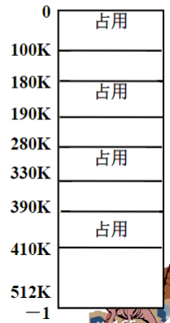
* * A. 190K
  * B. 100K
  * C. 410K
  * D. 330K

 **答案** : D
 **解析** : 最佳适应算法选择能满足要求的最小空闲分区。图中显示的空闲分区有：100K-180K(80K)，190K-280K(90K)，330K-390K(60K)，410K-512K(102K)。需要40K空间，符合要求的有四个区域，其中最小的是330K-390K(60K)根据题意，应选择330K起始的分区。

### 选择题3

1. 采用分段存储管理的系统中，若地址用24位表示，其中8位表示段号，则允许每段的最大长度是 _____ 。
   * A. 2^16
   * B. 2^32
   * C. 2^24
   * D. 2^8

 **答案** : A
 **解析** : 在分段系统中，地址由段号和段内偏移组成。24位地址中，8位用于表示段号，那么段内偏移就有24-8=16位，因此每段的最大长度为2^16字节。

2. 在固定分区分配中，每个分区的大小是 _____ 。
   * A. 可以不同但预先固定
   * B. 相同
   * C. 随作业长度变化
   * D. 可以不同但根据作业长度固定

 **答案** : A
 **解析** : 固定分区分配方式将内存空间划分为若干个固定大小的分区，每个分区可以容纳一道程序。这些分区的大小可以不同，但都是预先固定的，在系统运行期间不能改变。

### 选择题4

1. 把作业地址空间使用的逻辑地址变成内存的物理地址称为 _____ 。
   * A. 加载
   * B. 重定位
   * C. 物理化
   * D. 逻辑化

 **答案** : B
 **解析** : 重定位是指将逻辑地址转换为物理地址的过程，也称为地址变换或地址映射。

2. 在以下存储管理方案中，不适用于多道程序设计系统的是 _____ 。
   * A. 固定式分区分配
   * B. 单一连续分配
   * C. 可变式分区分配
   * D. 页式存储管理

 **答案** : B
 **解析** : 单一连续分配方式将内存分为系统区和用户区，系统区给操作系统使用，用户区只能给一道用户作业使用。这种方式不支持多个程序同时驻留内存，因此不适用于多道程序设计系统。

### 选择题5

1. 在可变式分区分配方案中，某一作业完成后，系统收回其内存空间并与相邻空闲区合并，为此需修改空闲区表，造成空闲区数减1的情况是 _____ 。
   * A. 有下邻空闲区但无上邻空闲区
   * B. 有上邻空闲区但无下邻空闲区
   * C. 有上邻空闲区也有下邻空闲区
   * D. 无上邻空闲区也无下邻空闲区

 **答案** : C
 **解析** : 当回收分区时，如果只有一侧有邻接的空闲分区（要么上面有，要么下面有），合并后空闲分区的数量减0。如果上下都有空闲分区，合并后空闲分区数量减1。如果上下都没有空闲分区，则空闲分区数量增加1。

2. 采用两级页表的页式存储管理中，按给定的逻辑地址进行读写时，通常需访问主存的次数是 _____ 。
   * A. 1次
   * B. 2次
   * C. 3次
   * D. 4次

 **答案** : C
 **解析** : 在两级页表系统中，访问一个数据需要：

1. 访问一级页表获取二级页表地址
2. 访问二级页表获取物理块号
3. 访问实际数据
   总共需要3次内存访问。

### 选择题6

1. 分页系统中的页面是_____。
   * A. 用户感知的
   * B. 操作系统感知的
   * C. 编译程序感知的
   * D. 链接装配程序感知的

 **答案** : B
 **解析** : 页面是操作系统将内存进行物理划分的单位，对用户程序来说是透明的，用户无需感知页面的存在，这是由操作系统管理的。

2. 下述内存分配算法中，_____ 更易产生无法利用的小碎片。
   * A. 首次适应算法
   * B. 循环首次适应算法
   * C. 最佳适应算法
   * D. 最坏适应算法

 **答案** : C
 **解析** : 最佳适应算法总是选择能满足要求的最小空闲分区，这样分割后往往会剩下很小的空闲区，而这些小空闲区通常难以被利用，从而形成无法使用的碎片。

## 填空题答案

### 填空题1

在分区分配算法中，首次适应算法倾向于优先利用内存中的 ① **低地址** 部分的空闲分区，从而保留了 ② **高地址** 部分的大空闲区。

段页式存储管理中，是先将作业分 ①  **段** ，② **段** 内分 ③  **页** 。分配以 ④ **物理块** 为单位。在不考虑使用联想存储器的情况下，执行程序时需要 ⑤ **3** 次访问内存，其中第 ⑥ **2** 次是查作业的页表。

### 填空题2

把作业装入内存中随即进行地址变换的方式称为 ①  **静态地址变换** ，而在作业执行期间，当访问到指令或数据时才进行地址变换的方式称为 ②  **动态地址变换** 。

三种不连续内存管理方式是： ①  **分页存储管理** 、 ② **分段存储管理** 和 ③  **段页式存储管理** 。

分区存储管理可以分为： ① **固定** 分区和 ② **动态** 分区。

### 填空题3

对右图所示的内存分配情况，若要申请30K的存储空间，使首地址最大的分配策略是  **最坏适应算法** 。

 **解析** : 从图中可以看出空闲区域为：100K-160K(60K)，200K-320K(120K)，350K-400K(50K)，410K-600K(190K)。需要30K空间，四个空闲区都能满足要求。最坏适应算法会选择最大的空闲区（首地址为410K）。

## 考研题答案

### 考研题1

1. 分区分配内存管理方式的主要保护措施是（）。09

* A. 界地址保护
* B. 程序代码保护
* C. 数据保护
* D. 栈保护

 **答案** : A
 **解析** : 在分区分配内存管理方式中，主要使用界地址保护（界限寄存器法）来防止一个进程访问其他进程的内存空间。通过设置上下界寄存器或基址限长寄存器，检查内存访问是否越界。

2. 一个分段存储管理系统中，地址长度为32位，其中段号占8位，则最大段长为（）。09
   * A. 2^8字节
   * B. 2^16字节
   * C. 2^24字节
   * D. 2^32字节

 **答案** : C
 **解析** : 在32位地址中，段号占8位，那么段内偏移占32-8=24位，因此最大段长为2^24字节。

### 考研题2

某基于动态分区存储管理的计算机，其主存容量为55MB（初始为空），采用最佳适配算法，分配和释放的顺序为：分配15MB，分配30MB，释放15MB，分配8MB，分配6MB，此时主存中最大空闲分区的大小是 。10

* A. 7MB
* B. 9MB
* C. 10MB
* D. 15MB

 **答案** : B
 **解析** :

1. 初始状态：一个55MB的空闲区
2. 分配15MB后：剩余40MB空闲区
3. 分配30MB后：剩余10MB空闲区
4. 释放15MB后：有两个空闲区（10MB和15MB）
5. 采用最佳适配算法分配8MB时，选择10MB的空闲区，剩余2MB
6. 采用最佳适配算法分配6MB时，选择15MB的空闲区，剩余9MB
7. 此时最大的空闲分区是9MB和2MB中的较大者，即9MB

答案应为B。9MB。

### 考研题3

某计算机采用二级页表的分页存储管理方式，按字节编址，页大小为2^10字节，页表项大小为2字节，逻辑地址结构为：
页目录号 | 页号 | 页内偏移量

逻辑地址空间大小为2^16页，则表示整个逻辑地址空间的页目录表中包含表项的个数至少是 。10

* A. 64
* B. 128
* C. 256
* D. 512

 **答案** : C
 **解析** :

1. 页大小为2^10字节，页内偏移需要10位
2. 逻辑地址空间有2^16页，表示页号需要16位
3. 每个页表项2字节，一个页(2^10字节)可以存放2^10/2=2^9个页表项
4. 用二级页表管理，一个二级页表可以管理2^9页
5. 总共需要2^16/2^9=2^7=128个二级页表
6. 页目录表中需要有128个表项才能表示这些二级页表
7. 但考虑到页号有16位，而一级和二级页表加起来必须用掉16位，如果二级页表用9位，则一级页表需要7位，可表示128个页目录项
8. 然而题目中的"页目录号|页号|页内偏移量"结构表明页目录号和页号是分开的，这意味着如果每个二级页表管理2^8=256页，则共需2^16/2^8=2^8=256个二级页表，即页目录表需要256个表项

答案应为C。256。
