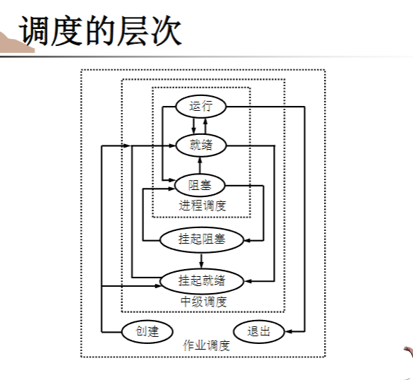
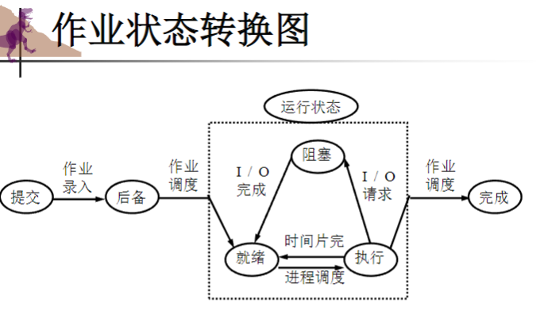
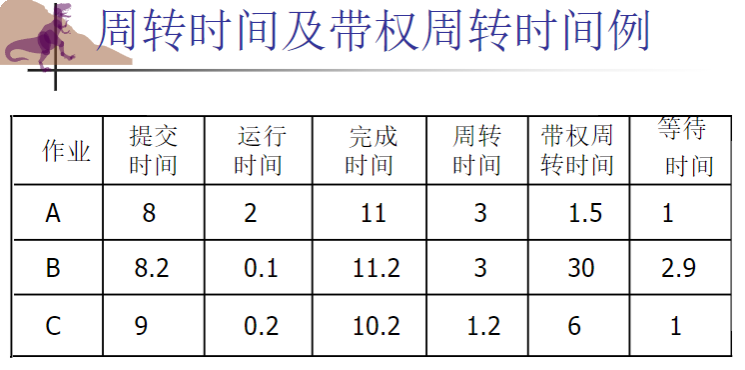
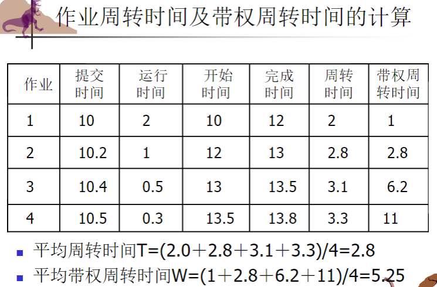
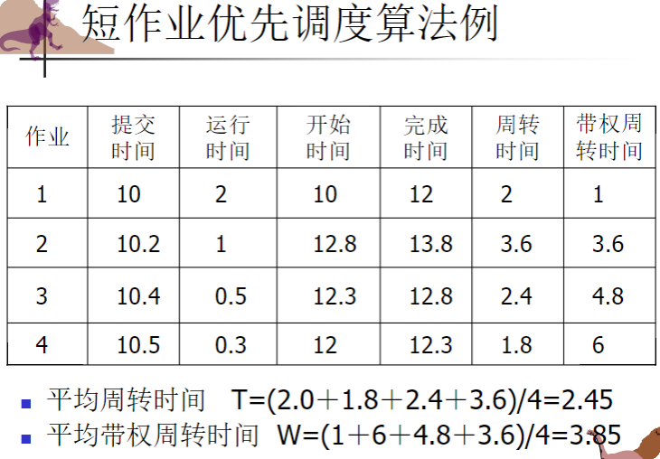
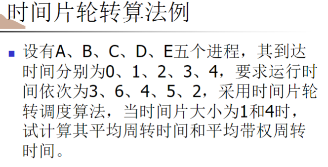
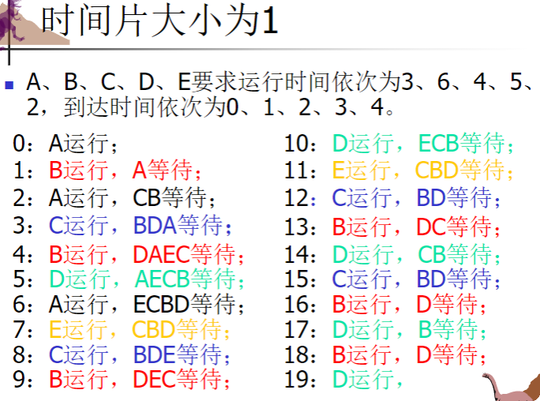
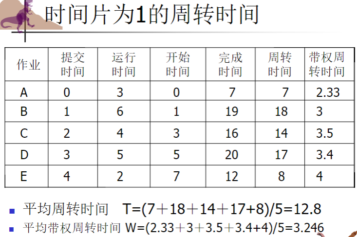

我会帮你梳理第5章 CPU调度的知识点，并根据你提供的材料补充一些细节和例子，让你对这部分内容有更全面的理解。

# CPU调度知识点梳理

## 1. 基本概念

CPU调度是操作系统的核心功能，它决定哪个进程在何时获得CPU资源。多道程序设计的主要目标是最大化CPU利用率，确保CPU在任何时候都保持忙碌状态。

### 1.1 调度的层次

操作系统中的调度分为三个层次：

1. **高级调度(作业调度)**
   * 负责将外存上的作业调入内存，分配必要资源
   * 运行频率低，几分钟一次
   * 主要功能：记录进入系统的作业情况，从后备作业中选择作业投入执行，为选中作业做好执行准备，并且善后
2. **中级调度(交换调度)**
   * 负责将内存中暂时不用的信息转移到外存，腾出内存空间
   * 运行频率介于高级和低级调度之间
   * 目的：提高内存利用率和系统吞吐量
3. **低级调度(进程调度)**
   * 决定就绪队列中哪个进程获得CPU资源
   * 运行频率高，几十毫秒一次
   * 主要功能：记录系统中所有进程的状态、优先数和资源情况，选择获得处理机的进程，实施处理机的分配及回收

三者之间的关系可以通过状态转换图来展示

* 作业通过高级调度从后备状态进入内存成为进程
* 进程通过低级调度在就绪、运行和阻塞状态间转换
* 进程通过中级调度在内存与外存之间进行交换
  图示：
* 

### 1.2作业的状态及转换

1、提交状态：用户作业由输入设备向系统外存输入时作业所处的状态

2、后备状态：作业输入到外存后，系统为其建立了作业控制块，并把它插入到后备作业队列中等待调度运行

3、运行状态：作业在内存中执行

4、完成状态：作业正常或异常结束，但作业占有的资源还未被系统全部回收

### 1.2.1 作业控制块

系统通过作业控制块(JCB)来管理作业，JCB是作业存在的唯一标志，主要包含：

* 资源要求：估计运行时间、最迟完成时间、需要的内存容量、外设类型及数量等
* 资源使用情况：进入系统时间、开始运行时间、已运行时间等
* 作业控制方式、类型和优先级
* 作业名、作业状态等

### 1.3 CPU-I/O区间周期

进程执行过程中会交替进行CPU计算和I/O等待，形成CPU区间和I/O区间的交替序列：

* **CPU区间** : 进程使用CPU执行计算的时间段
* **I/O区间** : 进程等待I/O操作完成的时间段

研究表明，CPU区间长度分布呈现为大量短CPU区间和少量长CPU区间的特点，这一特性对调度算法的选择有重要影响。

### 1.4 进程调度方式

进程调度有两种基本方式：

1. **非抢占式调度(Non-preemptive Scheduling)**
   * 一旦进程获得CPU，就一直运行直到完成或自愿放弃CPU（如进入阻塞状态）
   * 特点：简单，系统开销小，但无法处理紧急任务
   * 适用场景：批处理系统
2. **抢占式调度(Preemptive Scheduling)**
   * 允许操作系统根据某种原则（如更高优先级进程到达、时间片用完）强制剥夺正在运行进程的CPU
   * 特点：复杂度高，系统开销大，但可以及时处理紧急任务
   * 适用场景：交互式系统、实时系统

### 1.5 引起进程调度的原因

主要有四种情况可能触发进程调度：

1. 正在运行的进程结束（非抢占）
2. 进程从运行状态转到等待状态（如进行I/O操作）（非抢占）
3. 进程从等待状态转到就绪状态（如I/O操作完成）（抢占）
4. 进程从运行状态转到就绪状态（如时间片用完）（抢占）

### 1.6 分派程序(Dispatcher)

分派程序是实际执行上下文切换的部分，负责：

* 保存当前进程的上下文
* 将CPU控制权交给被选中的进程
* 切换到用户态
* 跳转到用户程序的适当位置

分派延迟(Dispatch Latency)是指从一个进程切换到另一个进程所需的时间，也被称为调度时间。这是系统开销的一部分，应尽量减小。

## 2. 调度准则

评价CPU调度算法的主要准则包括：

1. **CPU利用率** : 保持CPU尽可能忙碌
2. **吞吐量** : 单位时间内完成的进程数
3. **周转时间** : 从进程提交到完成的时间
4. **等待时间** : 进程在就绪队列中等待的总时间
5. **响应时间** : 从提交请求到首次响应的时间

通常希望最大化CPU利用率和吞吐量，最小化周转时间、等待时间和响应时间。

### 2.1 周转时间和带权周转时间

* **周转时间** = 作业完成时间 - 作业提交时间
* **带权周转时间** = 周转时间 / 实际运行时间

带权周转时间反映了作业在系统中的相对效率，值越接近1表示效率越高。它综合考虑了作业的等待时间和执行时间，能更客观地评价调度算法的性能。

图例：

## 3. 调度算法

### 3.1 先来先服务调度(FCFS)

 **基本原理** ：按照进程请求CPU的顺序分配CPU，即先请求CPU的进程先获得服务。

 **特点** ：

* 实现简单，只需维护一个FIFO队列
* 非抢占式算法
* 有利于长作业，不利于短作业
* 可能导致护航效应(convoy effect)：短进程排在长进程后面，等待时间过长

 **例子** ：
假设三个进程P1、P2、P3的CPU需求时间分别为24、3、3个时间单位：

* 如果按P1、P2、P3顺序到达，平均等待时间为(0+24+27)/3 = 17
* 如果按P2、P3、P1顺序到达，平均等待时间为(0+3+6)/3 = 3

可见进程到达顺序对性能影响很大。

补充：FCFS周转时间计算图示

### 3.2 最短作业优先调度(SJF)

 **基本原理** ：选择执行时间最短的进程优先执行。

 **特点** ：

* 可以证明，当一批作业同时到达时，SJF可以获得最短的平均周转时间
* 分为抢占式和非抢占式两种实现
* 抢占式SJF也称为最短剩余时间优先(SRTF)调度
* 主要问题是难以准确预知进程的执行时间
* 可能导致长作业饥饿(starvation)

 **例子** ：
假设四个作业A、B、C、D的到达时间为0、1、2、3，执行时间为8、4、9、5：

* 使用非抢占式SJF，执行顺序会是A开始，然后B、D、C
* 使用抢占式SJF(SRTF)，A开始执行，但1时刻B到达后A会被抢占，执行顺序变成B完成后D、A、C

 **数学证明** ：
当作业同时到达时，SJF算法能获得最短的平均周转时间，具体证明如下：
对于n个作业，假设其执行时间为t₁ ≤ t₂ ≤ ... ≤ tₙ，按照SJF算法调度的总周转时间为：
T = n·t₁ + (n-1)·t₂ + ... + 1·tₙ

对于任意一种排列i₁, i₂, ..., iₙ的总周转时间会大于等于T。

同上补充：

### 3.3 时间片轮转调度(RR)

 **基本原理** ：每个进程分配一个时间片，时间片用完后进程被挂起并放到就绪队列末尾。

 **特点** ：

* 特别适合交互式系统
* 响应时间 ≈ n × q (n为就绪进程数，q为时间片长度)
* 时间片大小选择很重要：太大会退化为FCFS，太小会导致过多的上下文切换开销
* 通常时间片设为10-100ms，而上下文切换时间一般少于10μs

 **确定时间片大小的因素** ：

* 系统对响应时间的要求：响应时间=时间片*进程数
* 就绪队列中的进程数目：时间片与就绪进程数成反比
* 系统处理能力：人所能承受的响应时间一定，系统速度快则时间片可增长

 **例子** ：
假设进程A、B、C的执行时间为10、6、3个时间单位：

* 若时间片为4：执行顺序为A(4)→B(4)→C(3)→A(4)→B(2)→A(2)，平均等待时间为(13+4+6)/3 = 7.67
* 若时间片为1：更频繁切换，响应更快但开销更大

 **虚拟时间片轮转算法** ：
为了解决普通RR对I/O密集型进程不公平的问题，引入虚拟时间片轮转算法：

* 新进程基于FCFS进入就绪队列
* 进程因I/O阻塞进入I/O队列，I/O完成后进入优先级高于就绪队列的附加队列
* 从附加队列调度的进程其运行时间不超过上次中断时剩余的时间
* 同上补充例子：
* 
* 
* 

### 3.4 优先级调度

 **基本原理** ：每个进程有一个优先级，CPU分配给优先级最高的进程。

 **特点** ：

* 优先级可分为静态优先级(创建时确定)和动态优先级(运行中调整)
* 静态优先级的确定可考虑：进程类型、资源需求、用户要求等
* 动态优先级的调整原则有：CPU使用时间、等待时间等
* 主要问题是可能导致低优先级进程饥饿(starvation)
* 解决饥饿问题的方法是老化(aging)，即随着等待时间增加逐渐提高进程的优先级

 **动态优先级计算公式示例** ：

* 优先数 = CPU使用时间/2 + 基本优先数
* CPU使用时间衰减函数: Decay(CPU使用时间) = CPU使用时间/2

### 3.5 高响应比优先调度

 **基本原理** ：选择响应比最高的进程优先执行，其中响应比 = 1 + 等待时间/执行时间。

 **特点** ：

* 综合考虑了等待时间和执行时间
* 等待时间相同时，有利于短作业
* 执行时间相同时，有利于等待时间长的作业
* 克服了SJF可能产生的饥饿问题

 **响应比计算** ：

* 响应比 = 1 + 作业等待时间/估计运行时间
* 响应比越高，优先级越高

### 3.6 多级队列调度

 **基本原理** ：将就绪队列分为多个独立的队列，每个队列有自己的调度算法。

 **特点** ：

* 进程根据其特性被永久分配到特定队列
* 队列之间通常有优先级关系，如前台交互式进程队列优先于后台批处理进程队列
* 每个队列可以使用不同的调度算法，如交互式队列使用RR，批处理队列使用FCFS

 **典型配置** ：

* 前台(交互式)队列：时间片轮转法
* 后台(批处理)队列：先来先服务法

### 3.7 多级反馈队列调度

 **基本原理** ：在多级队列的基础上，允许进程在不同队列之间移动。

 **特点** ：

* 设置多个优先级不同的队列，优先级高的队列时间片小
* 新进程进入最高优先级队列，若一个时间片内未完成则降到下一队列
* 高优先级队列为空时才调度低优先级队列的进程
* 高优先级队列有新进程到达时会抢占低优先级队列正在执行的进程
* 综合了多种调度算法的优点，可以同时满足各类进程需求

 **进程调度过程** ：

1. 新进程首先进入第1队列末尾
2. 按FCFS原则获得短时间片运行
3. 若时间片用完仍未完成，则进入第2队列末尾
4. 以此类推，直到最后一个队列使用时间片轮转算法

 **性能优势** ：

* 交互型进程：在高优先级队列获得快速响应
* 短批处理作业：在前几个队列完成，获得较短周转时间
* 长批处理作业：逐级下降但不会饥饿

## 4. 实际系统中的调度

现代操作系统通常采用复合的调度策略：

1. **Linux** : CFS(完全公平调度器)，基于进程的执行时间比例进行调度

* 通过红黑树结构维护进程的虚拟运行时间
* 总是选择虚拟运行时间最小的进程执行
* 虚拟运行时间根据进程的优先级和实际运行时间计算

1. **Windows** : 多级反馈队列的变种，考虑进程优先级和执行历史

* 32个优先级，分为实时(16-31)和动态(0-15)两组
* 动态优先级会根据进程行为动态调整
* I/O完成后进程优先级会短暂提升(提高交互性)

1. **Unix/类Unix系统** : 综合考虑优先级、时间片和交互性的调度策略

* 多级反馈队列的变形
* 优先级会随时间动态调整
* 考虑进程的CPU使用历史和I/O行为

## 5. 调度算法的选择

不同场景下适合不同的调度算法：

1. **批处理系统** : 强调吞吐量和周转时间，适合FCFS、SJF和优先级调度

* 目标：最大化吞吐量，最小化平均周转时间
* 通常无需考虑响应时间和交互性

1. **交互式系统** : 强调响应时间，适合时间片轮转和多级反馈队列

* 目标：提供快速响应，保持良好的用户体验
* 需要平衡响应时间和吞吐量

1. **实时系统** : 强调满足截止时间，需要特殊的实时调度算法

* 硬实时系统：必须在截止时间前完成任务
* 软实时系统：尽量在截止时间前完成任务，偶尔延迟可接受

## 6. 补充例题和实际应用

### 例题1: 各种调度算法的比较

假设有5个进程P1-P5，它们的到达时间和执行时间如下：

| 进程 | 到达时间 | 执行时间 |
| ---- | -------- | -------- |
| P1   | 0        | 10       |
| P2   | 1        | 1        |
| P3   | 2        | 2        |
| P4   | 3        | 1        |
| P5   | 4        | 5        |

比较不同调度算法的性能：

1. FCFS: 平均等待时间 = (0 + 9 + 10 + 12 + 13)/5 = 8.8
2. SJF(非抢占): 平均等待时间 = (0 + 9 + 12 + 0 + 4)/5 = 5.0
3. SJF(抢占): 平均等待时间 = (9 + 0 + 1 + 0 + 2)/5 = 2.4
4. RR(q=1): 平均等待时间 = (19 + 1 + 5 + 2 + 10)/5 = 7.4

### 例题2: 实时系统调度

考虑一个简单的实时系统，有3个周期性任务：

| 任务 | 周期 | 执行时间 | 截止时间 |
| ---- | ---- | -------- | -------- |
| T1   | 20   | 5        | 20       |
| T2   | 30   | 10       | 30       |
| T3   | 50   | 10       | 50       |

对于实时系统，我们需要验证所有任务是否能在截止时间前完成。
使用速率单调(Rate Monotonic)算法，优先级与周期成反比：T1 > T2 > T3。

通过可调度性分析可以确定这组任务是可调度的，因为：
5/20 + 10/30 + 10/50 = 0.25 + 0.33 + 0.2 = 0.78 < 1

## 小结

CPU调度是操作系统的核心功能，不同的调度算法各有优缺点：

* FCFS简单但对短作业不公平
* SJF理论上能获得最短平均周转时间，但难以预测执行时间
* RR提供良好的响应时间，适合交互系统
* 优先级调度灵活但可能导致饥饿
* 高响应比兼顾等待时间和执行时间
* 多级队列和多级反馈队列综合了多种算法的优点

在实际系统中，通常会根据应用场景和系统目标选择合适的调度算法或多种算法的组合。理解这些算法的原理和特点，有助于分析和优化系统性能。
