# 第八章 死锁 (Deadlocks)

## 1. 死锁概述

 **死锁定义** ：当一组进程中的每个进程都在等待一个事件，而这一事件只能由这组进程中的另一个进程引起，那么这组进程就处于死锁状态。简单来说，死锁是指多个进程因竞争系统资源或相互通信而造成的一种僵局，若无外力作用，这些进程都将永远不能向前推进。

 **死锁例子** ：

* 当两列火车在十字路口相向而行时，它们必须完全停下来，且在一列火车开走之前，另一列火车不能启动。
* 系统有两个磁带设备，进程P1和P2各占有一个磁带设备，但实际上每个进程都需要两个磁带设备才能完成工作。

## 2. 系统模型与资源类型

### 2.1 资源类型

* **可剥夺资源** ：某进程获得这类资源后，该资源可以被其他进程或系统剥夺。例如：CPU、内存空间。
* 注意：竞争可剥夺资源不会产生死锁！
* **非剥夺资源** （不可剥夺资源）：系统将这类资源分配给进程后，不能强行收回，只能在进程使用完后主动释放。例如：打印机、读卡机。
* **永久性资源** ：可顺序重复使用的资源。例如：打印机、处理器。
* **消耗性资源** ：由一个进程产生，被另一个进程使用短暂时间后便无用的资源，也称为临时性资源。例如：消息、信号量。

## 3. 死锁的特性

### 3.1 死锁产生的原因

死锁产生的主要原因包括：

1. **竞争资源** ：多个进程竞争资源，而资源又不能同时满足其需求。
2. **进程推进顺序不当** ：进程申请资源和释放资源的顺序不当。

具体场景：

* **竞争非剥夺资源引起的死锁** ：如打印机R1和读卡机R2供进程P1和P2共享，形成互相等待，如下图：
* 解释：进程P1已经获得了打印机资源R1，并且正在请求读卡机资源R2；进程P2已经获得了读卡机资源R2，并且正在请求打印机资源R1；这就形成了一个环路等待的情况：P1等待P2释放R2，而P2等待P1释放R1。结果是两个进程都无法继续执行，形成了死锁。
* 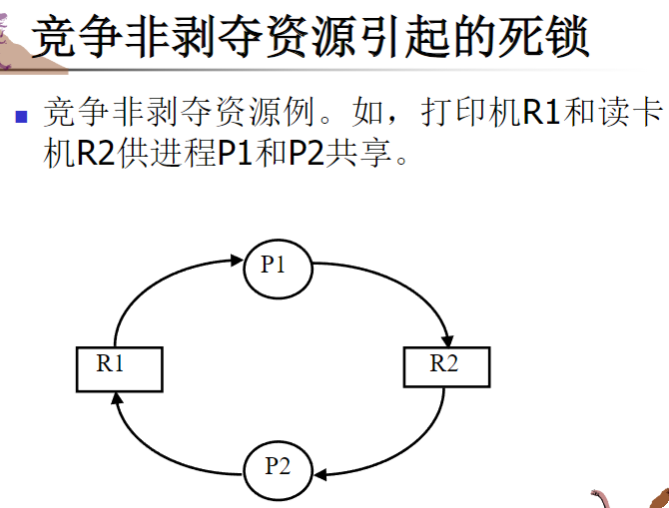
* **竞争消耗性资源引起的死锁** ：如消息通信按不当顺序进行，如下图：
* 解释：
* 不死锁情况：P1先释放S1再请求S2，P2先释放S2再请求S1，通信能够顺利进行，不会产生死锁。
* 死锁情况：P1在释放S1之前请求S2；P2在释放S2之前请求S1；如果两个进程都先执行了Request作，那么P1在等待P2释放S2，同时P2在等待P1释放S1，形成死锁
* 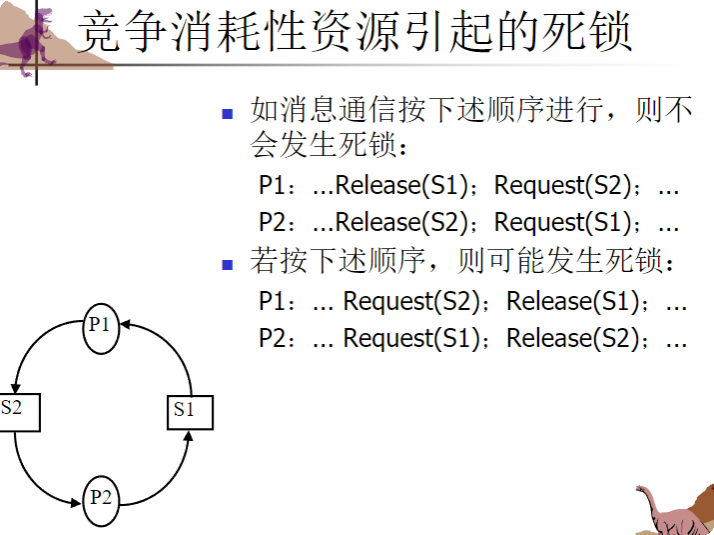
* **进程推进顺序不当引起的死锁** ：当进程请求和释放资源的顺序不合理时，如下图：
* 解释：
* 合法的推进路线（①②③）
* **路线（1）** :P 1先完成所有操作，再让P2执行（互不干扰）
* **路线（2）** :P 1申请A，P2申请B，P1申请B，P1释放AB，P2申请A，P2释放BA
* **路线（3）:P 2先完成所有操作，再让P1执行（互不干扰）**
* 不合法的推进线路（④）
* P1申请资源A后，P2申请资源B
* 接着P1尝试申请B（被P2占用），P2尝试申请A（被P1占用）
* 形成环路等待，进入**死锁区**
  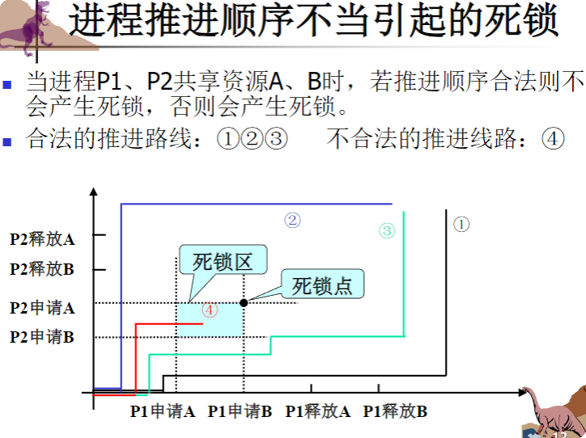

### 3.2 死锁产生的必要条件

死锁发生必须同时满足以下四个条件：

1. **互斥条件** ：资源一次只能被一个进程使用，不能共享。
2. **请求和保持条件** （占有并等待）：进程已持有至少一个资源，同时又请求其他被占用的资源。
3. **不剥夺条件** （非抢占）：资源只能由占有它的进程自愿释放，不能被强行剥夺。
4. **循环等待条件** ：存在一个进程等待链，形成一个环。

### 3.3 资源分配图

资源分配图又节点集合V和边集E组成，是描述进程与资源之间关系的有向图：

* 圆形节点：表示进程
* 方形节点：表示资源类型，方框中的圆点表示该类资源的实例数
* 请求边：从进程指向资源的有向边（P→R）
* 分配边：从资源指向进程的有向边（R→P）
* 图例：
* 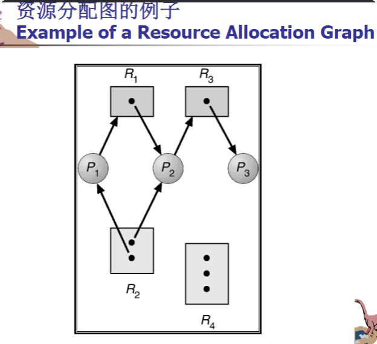

 **重要结论** ：

* 如果资源分配图没有环，则系统没有死锁
* 如果资源分配图有环，则系统可能有死锁
  * 若每种资源仅有一个实例，则有环即有死锁。
  * 若资源有多个实例，则有环不一定有死锁。
  * 实例分析：

    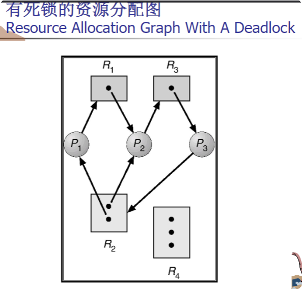
  * 分析：所有的实例都被进程分配了，并且这些进程还在申请其他资源，所以就死锁了。
  * 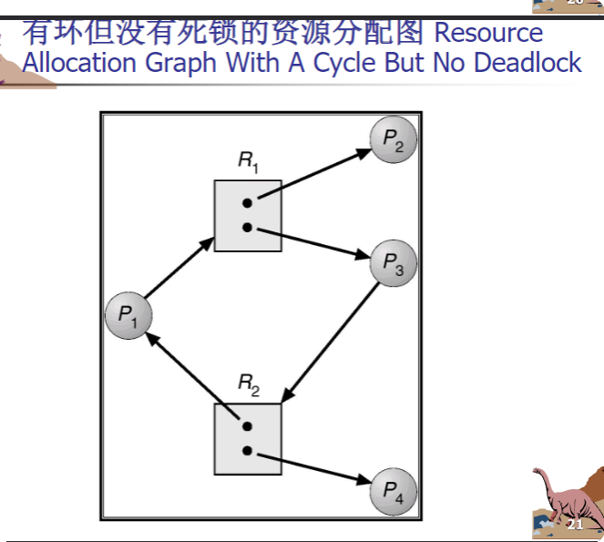
  * 分析：这个虽然所有实例都被进程占用了，但是P2,P4并没有再索要资源，他们完成后就会释放，所以你就可以去掉P2,P4代表的圆形和有向线段来看，当然就不死锁了。

## 4. 处理死锁的方法

处理死锁的基本方法有四种：

1. **忽略死锁** （鸵鸟算法，来历就是鸵鸟可以把头埋进沙子里面假装看不见😊）：假装死锁不存在，适用于死锁极少发生的系统。

* 被大多数操作系统采用，包括UNIX和Windows。

  2.**死锁预防** ：设置某些限制条件，破坏死锁产生的四个必要条件之一。
* 优点：实现简单
* 缺点：限制严格，资源利用率低

  3.**死锁避免** ：在资源动态分配过程中，通过算法防止系统进入不安全状态。
* 优点：资源利用率较高
* 缺点：实现难度较大

  4.**死锁检测与恢复** ：允许死锁发生，但设置检测机制及时发现并解除死锁。
* 优点：资源利用率高
* 缺点：实现复杂度最高

## 5. 死锁预防

死锁预防是通过破坏死锁产生的四个必要条件之一来防止死锁发生。

### 5.1 破坏互斥条件

通常不能通过否定互斥条件来预防死锁，因为很多资源本身就是非共享的，互斥是设备固有的属性。

### 5.2 破坏请求和保持条件

 **方法** ：采用静态资源分配法，要求进程一次申请所需的全部资源，若系统能满足则分配，否则不分配任何资源。

 **特点** ：

* 简单、安全且易于实现
* 资源利用率低，进程延迟运行

### 5.3 破坏不剥夺条件

 **方法** ：当进程请求新资源不能满足时，必须释放已获得的所有资源，待以后重新申请。

 **特点** ：

* 实现较复杂
* 释放已获得资源可能导致前一段工作失效
* 重复申请和释放资源会增加系统开销，降低系统吞吐量

### 5.4 破坏循环等待条件

 **方法** ：采用有序资源分配法，将所有资源按类型排序并赋予不同序号，要求进程严格按照序号递增的顺序请求资源。

 **特点** ：

* 资源利用率较高
* 资源序号需要相对稳定
* 限制了新设备的增加
* 若使用资源顺序与规定顺序不同，可能造成浪费
* 使用资源的次序限制用户编程

 **为什么有序资源分配法可以防止死锁** ：
如果按照资源编号升序申请资源，系统中总会存在一个进程，它占有编号最高的资源，其继续请求的资源必定是空闲的，因此该进程可以一直推进直至完成。依此类推，所有进程最终都能完成，不会发生死锁，如图：

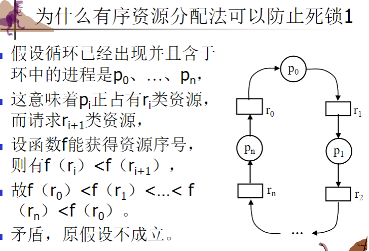

## 6. 死锁避免

定义：死锁避免是在资源的动态分配过程中，用算法动态检查每次分配是否会导致系统进入不安全状态，从而避免死锁的发生。

特点：以较弱的限制获得较高的利用率，但实现有一定难度。

### 6.1.1资源分配状态

定义：可用资源、已分配资源和进程所需的最大资源数量定义。

### 6.1.2 安全状态与不安全状态

 **安全状态** ：系统能按某种顺序（安全序列）为每个进程分配其所需资源，使每个进程都能顺利完成。如果每个进程Pi所申请的资源数可以由当前可用资源数加上其他所有进程Pj(j<i)所持有的该资源数的和来满足，则进程序列<P1,P2,...,Pn>是安全的，称序列<P1、P2、...、Pn>为安全序列。

 **不安全状态** ：不存在安全序列的系统状态。

安全状态如图，安全序列：p1->p0->p2


 **重要性质** ：

* 安全状态不是死锁状态
* 死锁状态一定是不安全状态
* 不安全状态不一定是死锁状态，但可能导致死锁

### 6.2 银行家算法

银行家算法是最具代表性的死锁避免算法，由Dijkstra提出。

 **基本思想** ：

* 每个进程必须事先声明资源最大使用量
* 当进程申请资源时，系统检查分配后是否仍处于安全状态
* 若安全则分配，否则进程等待

 **数据结构** ：

* n、m:分别是进程的数目和资源类型的数目
* **可用资源向量Available** ：长度为m的向量，表示每种资源的可用实例数。
* 例如：available[j]=k,那么Rj类资源现在有k个实例
* 
* **最大需求矩阵Max** ：n×m矩阵，表示每个进程的最大需求量。
* 例如：Max[i,j]=k,那么进程Pi最多可以请求Rj类资源的k个实例
* 
* **分配矩阵Allocation** ：n×m矩阵，表示每个进程已分配的资源量。
* 例如：Allocation[i,j]=k,那么进程Pi当前分配了Rj类资源的k个实例。并且Allocationi表示进程Pi的分配向量，由矩阵Allocation的第i行构成，就是这个进程要的各种类型的资源的所有实例的集合。
* 
* **需求矩阵Need** ：n×m矩阵，表示每个进程还需的资源量（Need = Max - Allocation）。
* 例如：Need(i,j)＝k，表示进程Pi还需Rj类资源k个。同理：Needi表示进程Pi的需求向量，由矩阵Need的第i行构成。

 **安全性算法** ：

1. 初始化Work = Available，Finish[i] = false  i=1,2，...,n
2. 查找满足以下条件的进程i：
   * Finish[i] = false
   * Need_i ≤ Work
3. 若找到，则Work = Work + Allocation_i，Finish[i] = true，转步骤2
4. 若所有Finish[i] = true，则系统处于安全状态

 **资源请求算法(银行家算法)** ：

 补充：Requesti是进程Pi的请求向量，如Requesti(j)＝k，那么进程Pi需要Rj类资源k个

1. 检查Request_i ≤ Need_i，否则出错
2. 检查Request_i ≤ Available，否则等待
3. 试分配并修改数据结构：

   * Available = Available - Request_i
   * Allocation_i = Allocation_i + Request_i
   * Need_i = Need_i - Request_i
4. 执行安全性算法，若安全则正式分配，否则恢复数据并让进程等待
5. 一个例子如下图，实际操作可以自行学习：

   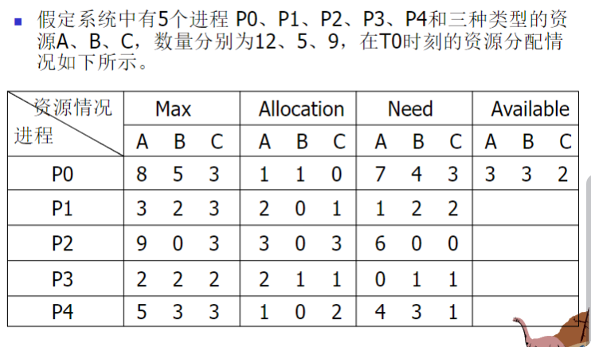

## 7. 死锁检测

定义：死锁检测是通过系统的检测机构及时发现死锁的发生，然后采取措施解除死锁。

特点：死锁检测和解除可使系统获得较高的利用率，但是实现难度最大。

### 7.1 死锁判定法则

 **资源分配图简化法** ：

1. 找出既不阻塞又非孤立的进程节点，该进程能获得所需的全部资源，运行完成然后释放
2. 再消去该进程的所有请求边和分配边，使之成为孤立节点
3. 重复步骤1和2
4. 若能消去图中所有边，则无死锁；否则存在死锁
5. 补充：所有的简化顺序将得到相同的不可简化图

 **死锁定理** ：系统状态S为死锁状态当且仅当S状态的资源分配图是不可完全简化的。

实例：

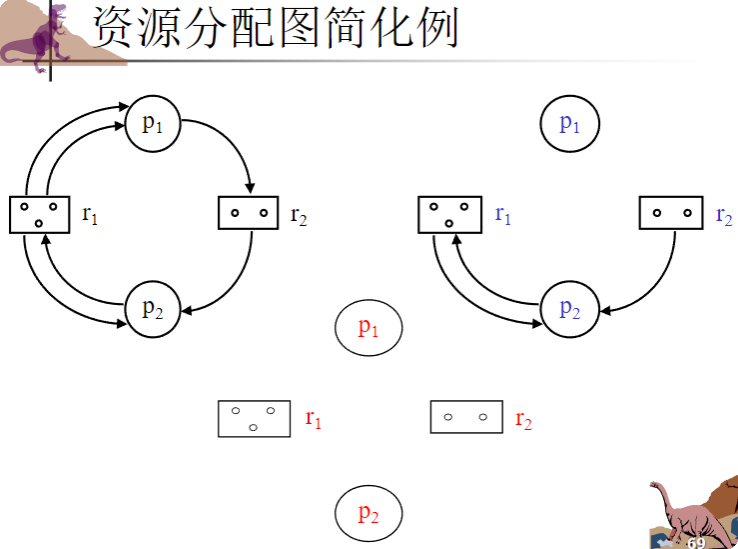

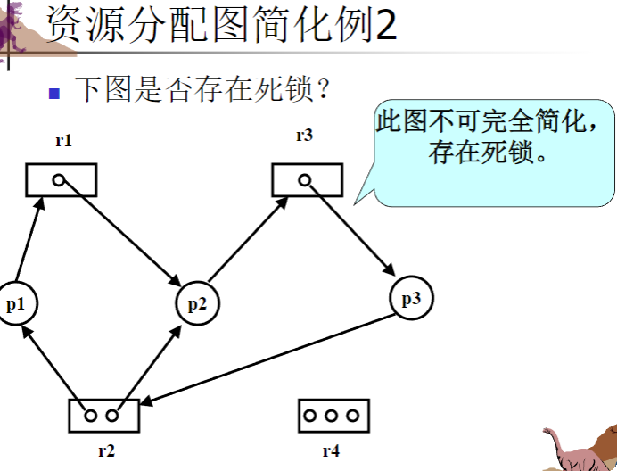

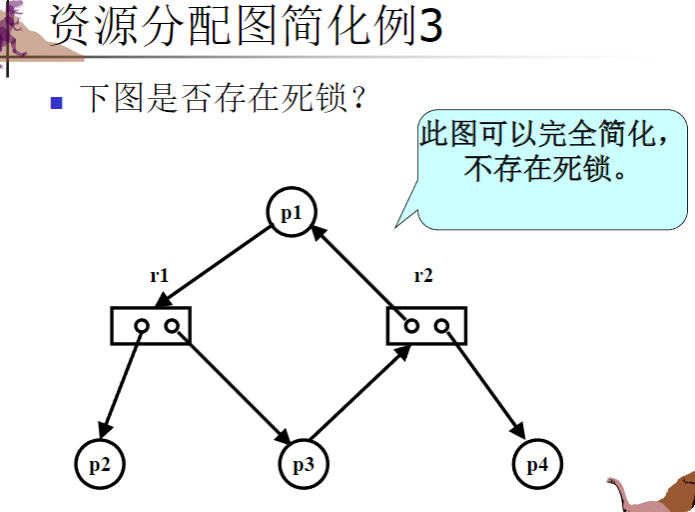

### 7.2 死锁检测算法

死锁检测算法类似于银行家算法的安全性算法，区别在于银行家算法是预测性的（防止进入不安全状态），而死锁检测算法是判断当前状态是否已经是死锁状态。

#### 7.2.1死锁检测算法中的数据结构

1、可用资源向量Available：长度为m的向量，表示每类资源的可用数目

2、分配矩阵Allocation：n×m矩阵，表示当前每个进程已分配的资源数目

3、请求矩阵Request：n×m矩阵，表示当前每个进程的资源请求数目

4、工作向量Work：表示系统当前可提供资源数

5、进程集合L：记录当前已不占用资源的进程

#### 7.2.2死锁检测算法实例

```C/C++
# 死锁检测算法

# 初始化工作向量为系统当前可用资源数量
Work = Available;

# 初始化L为没有分配到任何资源也没有请求任何资源的进程集合
# (这些进程已经结束或尚未开始)
L = <Li | Allocationi = 0 ∩ Requesti = 0>

# 对于所有不在L中的进程Li进行检查
for all Li ∉ L do
{
    # 检查进程Li的请求是否能被当前可用资源满足
    if (Requesti ≤ Work)
    {
        # 假设进程Li获得资源并执行完毕，释放所持有的资源
        Work = Work + Allocationi;
      
        # 将进程Li添加到安全进程集合L中
        L = L ∪ Li;
    }
}

# 死锁判定：
# 如果L不包含所有进程，则存在死锁
# 否则，系统不存在死锁
deadlock = ¬(L == <p1, p2, ..., pn>)
```

## 8. 死锁恢复（死锁解除）

一旦检测出系统中出现死锁，就应将进程从死锁状态中解脱出来。常用的死锁解除方法有：

### 8.1 资源剥夺法

逐步从进程中抢占资源给其他进程使用，直到死锁环被打破。

 **需要解决的问题** ：

* 选择牺牲者（最小代价）
* 回退（返回到安全状态，重新启动进程）
* 饥饿（同一进程可能总是被选为牺牲者）

### 8.2 撤销进程法（进程终止）

 **两种方法** ：

* 终止所有死锁进程：直接打破死锁环，但代价大
* 一次只终止一个进程直到消除死锁：每终止一个进程都需重新检测死锁

 **影响选择终止进程的因素** ：

* 进程优先级
* 进程计算时间（已计算多久，还需多长时间完成）
* 进程使用的资源情况
* 需要终止的进程数
* 进程类型（交互式还是批处理）

### 8.3 处理死锁的综合方法

单独使用某种方法不能全面解决所有死锁问题，可将系统资源按层次分类，对每类资源使用最适合的方法：

 **例如** ：

* 内部资源（如PCB）：采用有序资源分配法
* 主存资源：采用资源剥夺法
* 作业资源（设备和文件）：采用死锁避免法
* 交换空间：采用静态分配法

## 9. 典型例题分析

### 安全状态判断例题

 **例题1** ：3个进程共享12个磁带机

```
进程  | 最大需求 | 已分配 | 还需资源 | 可用资源
-----|---------|--------|---------|--------
P1   | 10      | 5      | 5       | 3  
P2   | 4       | 2      | 2       |   
P3   | 9       | 2      | 7       |   
```

判断是否安全：

1. Work = [3]，未完成进程集合 = {P1, P2, P3}
2. P2的Need(2) ≤ Work(3)，分配后Work = 3+2 = 5，P2完成
3. P1的Need(5) ≤ Work(5)，分配后Work = 5+5 = 10，P1完成
4. P3的Need(7) ≤ Work(10)，分配后Work = 10+2 = 12，P3完成
5. 所有进程完成，系统安全，安全序列为<P2, P1, P3>

### 银行家算法例题

 **例题1** ：5个进程共享3种资源(A,B,C)

```
进程 | 最大需求     | 已分配      | 还需资源     | 可用资源
-----|-------------|------------|-------------|--------
    | A  B  C     | A  B  C    | A  B  C     | A  B  C
P0  | 8  5  3     | 1  1  0    | 7  4  3     | 3  3  2  
P1  | 3  2  3     | 2  0  1    | 1  2  2     |   
P2  | 9  0  3     | 3  0  3    | 6  0  0     |   
P3  | 2  2  2     | 2  1  1    | 0  1  1     |   
P4  | 5  3  3     | 1  0  2    | 4  3  1     |   
```

安全性检查：

1. Work = [3,3,2]，未完成进程集合 = {P0,P1,P2,P3,P4}
2. P1的Need(1,2,2) ≤ Work(3,3,2)，分配后Work = (5,3,3)，P1完成
3. P3的Need(0,1,1) ≤ Work(5,3,3)，分配后Work = (7,4,4)，P3完成
4. P4的Need(4,3,1) ≤ Work(7,4,4)，分配后Work = (8,4,6)，P4完成
5. P2的Need(6,0,0) ≤ Work(8,4,6)，分配后Work = (11,4,9)，P2完成
6. P0的Need(7,4,3) ≤ Work(11,4,9)，分配后Work = (12,5,9)，P0完成
7. 所有进程完成，系统安全，安全序列为<P1,P3,P4,P2,P0>

## 10. 总结

死锁是操作系统中的一个重要问题，合理地处理死锁对于提高系统性能和可靠性至关重要。根据不同场景和需求，可以选择适当的死锁处理策略：

1. **死锁预防** ：简单但限制严格，适用于资源受限的系统
2. **死锁避免** ：灵活但需要预先了解资源使用情况，适用于可预测的环境
3. **死锁检测与恢复** ：资源利用率高但实现复杂，适用于资源丰富的系统
4. **忽略死锁** ：适用于死锁发生概率极低的系统

在实际应用中，往往采用多种方法的组合来处理死锁问题，针对不同类型的资源选择最适合的处理策略。
