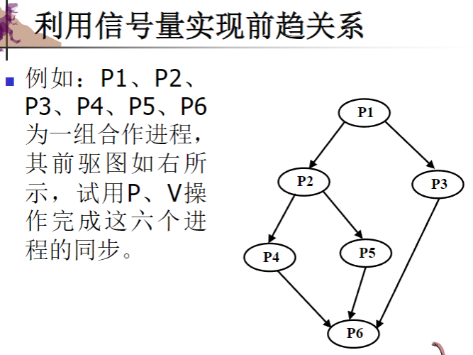

# 操作系统第六、七章：进程同步与同步实例

## 第六章：同步工具

### 1. 进程同步基础概念

#### 1.1 进程的相互制约

* **直接制约关系** ：合作进程之间产生的制约关系
* **间接制约关系** ：共享资源产生的制约关系

#### 1.2 竞争条件

* **定义** ：多个进程并发访问和操作同一数据，且执行结果与访问发生的特定顺序有关
* **解决方法** ：并发进程必须同步

#### 1.3 共享变量的问题

例如，两个进程同时执行 x 加 1 的操作：

```
A:              B:
R1 = x;         R2 = x;
R1 = R1 + 1;    R2 = R2 + 1;
x = R1;         x = R2;
```

* 如果顺序执行A后B，x值增加2
* 如果交错执行（R1=x; R2=x; R1=R1+1; x=R1; R2=R2+1; x=R2），则x值只增加1
* 这种错误称为"与时间有关的错误"，因为没有互斥使用共享变量

### 2. 临界区问题

    如何保证一个进程在其临界区执行时，不允许其他进程在其临界区执行

#### 2.1 临界区定义

* **临界资源** ：一段时间内仅允许一个进程使用的资源,如打印机，共享变量
* **临界区/临界段** ：进程中访问临界资源的那段代码，注意是代码，也叫临界段
* **同类临界区** ：所有与同一临界资源相关联的临界区

#### 2.2 临界区问题的通用结构

```
do {
    进入区 entry section      // 检查是否可进入临界区
    临界区 critical section   // 访问临界资源
    退出区 exit section       // 指示已经离开临界区
    剩余区 remainder section  // 执行其他代码
} while(true);
```


#### 2.3临界区问题的解决条件详细解释

##### 1. 互斥（Mutual Exclusion）

 **条件说明** ：如果进程Pi在其临界区内执行，那么其他进程不能在临界区内执行。

 **详细解释** ：

* 这是最基本的要求，确保共享资源在任一时刻只被一个进程访问
* 防止多个进程同时修改共享数据导致的不一致性
* 实现方式包括锁、信号量、互斥量等机制
* 例如：两个进程不能同时写入同一个文件，否则可能导致文件损坏

##### 2. 前进（Progress）

 **条件说明** ：如果没有进程在临界区内执行且有进程需要进入临界区，那么只有那些不在剩余区执行的进程可以参与决定下一个进入临界区的进程，且这种决定不能无限期推迟。

 **详细解释** ：

* "剩余区"指进程执行与共享资源无关的代码部分
* 这个条件确保了系统的活性（liveness），防止死锁
* 意味着如果临界区空闲，且有进程请求进入，那么必须允许某个进程进入
* 决定哪个进程进入的过程不能无限延迟
* 避免了所有进程都在等待，而临界区却空着的情况

##### 3. 有限等待（Bounded Waiting）

 **条件说明** ：一个进程提出进入临界区请求后到该请求得到允许的这段时间内，其他进程进入临界区的次数必须有限。

 **详细解释** ：

* 防止某个进程被无限期地“饿死”（starvation）
* 确保每个请求进入临界区的进程最终都能获得访问权
* 保证了公平性，防止某些进程反复进入临界区而其他进程永远等待
* 例如：先来先服务或轮转法等调度算法可以帮助实现这一条件

"前进"与"有限等待"的区别

* **前进**关注的是系统整体不会停滞，确保临界区不会空闲而又有进程在等待
* **有限等待**关注的是单个进程的公平性，确保每个进程都能在有限时间内获得服务

#### 2.4 访问临界资源应遵循的原则

1. **空闲让进** ：若无进程处于临界区时，应允许一个进程进入临界区
2. **忙则等待** ：当已有进程进入临界区，其他进程必须等待
3. **有限等待** ：应保证要求进入临界区的进程在有限时间内进入临界区
4. **让权等待** ：当进程不能进入自己的临界区时，应释放处理机

#### 2.5 同步与互斥

* **同步** ：多个相互合作的进程在关键点上需要互相等待或交换信息的相互制约关系
* **互斥** ：当一个进程使用某资源时，其他希望使用该资源的进程必须等待，直到该进程释放资源后才允许其他进程访问

### 3. Peterson 算法及其他软件解决方案

#### 3.1 算法1 - 轮转法

int turn = 0;  // 指示轮到哪个进程

// 进程P0
do {
    while (turn != 0);  // 等待轮到自己，turn!=0时，就是死循环一直等待
    临界区代码CS0;
    turn = 1;  // 轮到P1
    其他代码;
} while (true);

// 进程P1
do {
    while (turn != 1);  // 等待轮到自己，同上
    临界区代码CS1;
    turn = 0;  // 轮到P0
    其他代码;
} while (true);

问题：两个进程必须以交替次序进入临界区，不满足"空闲让进"原则

#### 3.2 算法2 - 标志法

```
boolean flag[2] = {false, false};  // 表示进程是否在临界区

// 进程P0
do {
    while (flag[1]);  // 检查P1是否在临界区
    flag[0] = true;   // 标记P0进入临界区
    临界区代码CS0;
    flag[0] = false;  // 标记P0离开临界区
    其他代码;
} while (true);

// 进程P1
do {
    while (flag[0]);  // 检查P0是否在临界区
    flag[1] = true;   // 标记P1进入临界区
    临界区代码CS1;
    flag[1] = false;  // 标记P1离开临界区
    其他代码;
} while (true);
```

问题：解决了空闲让进，但可能两个进程同时进入临界区（违背"忙则等待"）

#### 3.3 算法3 - 先标记后检查法

```
boolean flag[2] = {false, false};  // 表示进程是否想进入临界区

// 进程P0
do {
    flag[0] = true;   // 标记P0想进入临界区
    while (flag[1]);  // 检查P1是否也想进入
    临界区代码CS0;
    flag[0] = false;  // 标记P0不再想进入临界区
    其他代码;
} while (true);

// 进程P1
do {
    flag[1] = true;   // 标记P1想进入临界区
    while (flag[0]);  // 检查P0是否也想进入
    临界区代码CS1;
    flag[1] = false;  // 标记P1不再想进入临界区
    其他代码;
} while (true);
```

问题：可能导致两个进程都进不了临界区（互相谦让）

#### 3.4 算法4 - Peterson算法

```
boolean flag[2] = {false, false};  // 表示进程是否想进入临界区
int turn;  // 指示优先让哪个进程进入临界区

// 进程P0
do {
    flag[0] = true;   // 标记P0想进入临界区
    turn = 1;         // 优先让P1进入
    while (flag[1] && turn == 1);  // 若P1想进入且优先级给P1，则等待
    临界区代码CS0;
    flag[0] = false;  // 标记P0不再想进入临界区
    其他代码;
} while (true);

// 进程P1
do {
    flag[1] = true;   // 标记P1想进入临界区
    turn = 0;         // 优先让P0进入
    while (flag[0] && turn == 0);  // 若P0想进入且优先级给P0，则等待
    临界区代码CS1;
    flag[1] = false;  // 标记P1不再想进入临界区
    其他代码;
} while (true);
```

Peterson算法是正确的，可以保证互斥访问并避免死锁，其实就是算法1和3的结合。

### 4. 同步的硬件解决方案

用硬件方法实现互斥的主要思想是**保证检查操作与修改操作不被打断**

#### 4.1 禁止中断 方法

```
过程：
关中断;   //禁止中断
临界区;	 //临界区代码执行
开中断;	 //运行中断
```

* **优点** ：简单直接
* **缺点** ：
* 限制了处理机交替执行程序的能力，降低执行效率
* 将关中断权力交给用户进程不安全，可能导致系统终止

#### 4.2 硬件指令方法

##### 4.2.1 Test-and-Set (TS) 指令

```
boolean TS(boolean *lock) {
    boolean old;
    old = *lock;      // 保存锁的原值
    *lock = true;     // 设置锁为占用状态
    return old;       // 返回锁的原值
}

// 使用TS实现互斥
do {
    while (TS(&lock));  // 若lock原值为true，则循环等待；
			//若为flase则会跳出循环，并且把*lock又设置为true
    临界区代码;
    lock = false;      // 释放锁
    其他代码;
} while (true);
```

##### 4.2.2 Swap 指令

```
void Swap(boolean *a, boolean *b) {  //就是一个*a与*b的交换
    boolean temp;
    temp = *a;
    *a = *b;
    *b = temp;
}

// 使用Swap实现互斥
do {
    key = true;
    while (key != false)   // 循环直到key变为false
        Swap(&lock, &key); // 交换lock和key的值；
			   //注意这一句是在循环之内的，只有当lock=1时，交换key才会变成0
    临界区代码;
    lock = false;         // 释放锁
    其他代码;
} while (true);
```

#### 4.3 锁机制

* **锁变量** ：表示资源状态，0表示资源可用(开锁)，1表示资源已被占用(关锁)
* **上锁原语** ：

```
  lock(w) 
 {  
     while (w == 1);  // 若已锁定则等待  
     w = 1;           // 加锁
 }
```

* **开锁原语** ：

```
  unlock(w) 
  {  
      w = 0;  // 解锁
  }
```

#### 4.4 自旋锁（上面这种机制）

* 当一个进程试图获取锁但锁已被占用时，进程会持续检查锁的状态（自旋）直到锁可用
* **适用场景** ：中断处理程序（不允许睡眠）
* **最佳使用时间** ：持有锁的时间小于两次上下文切换的时间
* **读/写自旋锁** ：允许多个进程同时读，但写操作需要独占锁

### 5. 信号量 (Semaphores)

#### 5.1 信号量定义

* 由荷兰科学家Dijkstra提出
* 信号量S是一个整型变量，除初始化外只能通过两个标准原子操作wait()和signal()访问
* 进程使用资源时对信号量执行wait，当释放资源时执行signal，可以理解为请求和释放
* ```
  wait(S) // 原称为P操作
  {  
       while (S <= 0)   
          do no-op;  
       S--;
  }

  signal(S) // 原称为V操作
  {   
     S++;
  }
  ```

#### 5.2 信号量类型

* **计数信号量** ：值可以是任意非负整数，初始化为可用资源的数量
* **二进制信号量** ：值只能为0和1，又称互斥锁

#### 5.3 信号量实现

```
/*
 * 5.3 信号量实现
 *
 * 信号量是一种同步机制，用于控制对共享资源的访问和进程间的同步
 * 它包含一个计数器和一个等待进程的队列
 */

// 信号量数据结构定义
typedef struct {
    int value;              // 信号量的值，初始非负：
                            // > 0: 表示可用资源数量
                            // = 0: 表示无可用资源，也无等待进程
                            // < 0: 表示等待进程数量的负值
    struct process *list;   // 等待进程队列: 存储被阻塞的进程，初始状态为空
} semaphore;

/*
 * wait操作 (也称为P操作或down操作)
 * 功能: 请求资源，如果资源不可用则阻塞进程
 * 参数: s - 指向信号量的指针
 * 注意: 此操作必须是原子的，不可中断
 */
wait(semaphore *s) {
    s->value--;             // 原子性地将信号量值减1(表示请求一个资源)
    if (s->value < 0) {     // 如果减1后小于0，说明没有可用资源
        add this process to s->list;  // 将当前进程加入等待队列
        block();            // 调用系统调用将进程挂起(从运行态变为阻塞态)
                            // 此时进程会释放CPU，直到被signal操作唤醒
    }
    // 如果value >= 0，表示仍有资源可用，进程可以继续执行
}

/*
 * signal操作 (也称为V操作或up操作)
 * 功能: 释放资源，如果有进程在等待则唤醒其中一个
 * 参数: s - 指向信号量的指针
 * 注意: 此操作必须是原子的，不可中断
 */
signal(semaphore *s) {
    s->value++;             // 原子性地将信号量值加1(表示释放一个资源)
    if (s->value <= 0) {    // 如果加1后值仍小于等于0，表示有进程在等待
                            // 注意: value <= 0时意味着原本有|value|个进程在等待
        remove a process P from s->list;  // 从等待队列中取出一个进程P
        wakeup(P);          // 调用系统调用将进程P唤醒(从阻塞态变为就绪态)
                            // 被唤醒的进程会进入就绪队列，等待CPU调度执行
    }
    // 如果value > 0，表示没有进程在等待，信号量值增加即可
```

补充说明：

1、P操作可能阻塞执行进程，而V操作可以唤醒其他进程,要根据value判断。

2、P、V操作在封锁中断的情况下执行，即一个进程在信号量上操作时，不会有别的进程同时修改该信号量。也就是说P、V操作是原语。

3、信号量比自旋锁有更好的处理器利用率，但开销比自旋锁大，信号量更适合锁会长时间持有的情况。

#### 5.4 信号量的物理含义

* 当value > 0：表示系统中当前可用资源的数目
* 当value < 0：其绝对值表示系统中因请求该类资源而被阻塞的进程数目

#### 5.5 利用信号量实现互斥

```
semaphore mutex = 1;  // 初值为1
main()
{ 
    cobegin //内部语句并发执行
    p1();
    p2(); 
    coend   //结束并发
}

P1() {
    P1剩余区;
    wait(mutex);
    P1的临界区;
    signal(mutex);
    P1剩余区;
}

P2() {
    P2剩余区;
    wait(mutex);
    P2的临界区;
    signal(mutex);
    P2剩余区;
}
```

#### 5.6 利用信号量实现前趋关系

可以使用信号量来控制进程的执行顺序，保证某些进程必须在其他进程之后执行，实例如下




```
// 解法1代码表示
// 设七个同步信号量a、b、c、d、e、f、g，初始值均为0

P1() {
    执行P1的代码;
    V(a);  // 释放信号量a，表示P1已完成相关操作，P2可以执行
    V(b);  // 释放信号量b，表示P1已完成相关操作，P3可以执行
}

P2() {
    P(a);  // 等待信号量a，表示需要等待P1完成相关操作
    执行P2的代码;
    V(c);  // 释放信号量c，表示P2已完成相关操作，P4可以执行
    V(d);  // 释放信号量d，表示P2已完成相关操作，P5可以执行
}

P3() {
    P(b);  // 等待信号量b，表示需要等待P1完成相关操作
    执行P3的代码;
    V(e);  // 释放信号量e，表示P3已完成相关操作，P6可以执行
}

P4() {
    P(c);  // 等待信号量c，表示需要等待P2完成相关操作
    执行P4的代码;
    V(f);  // 释放信号量f，表示P4已完成相关操作，P6可以执行
}

P5() {
    P(d);  // 等待信号量d，表示需要等待P2完成相关操作
    执行P5的代码;
    V(g);  // 释放信号量g，表示P5已完成相关操作，P6可以执行
}

P6() {
    P(e);  // 等待信号量e，表示需要等待P3完成相关操作
    P(f);  // 等待信号量f，表示需要等待P4完成相关操作
    P(g);  // 等待信号量g，表示需要等待P5完成相关操作
    执行P6的代码;
}
```


```
// 解法2代码表示
// 设五个同步信号量f1、f2、f3、f4、f5，初始值均为0

P1() {
    执行P1的代码;
    V(f1);  // 释放信号量f1，表示P1已执行完成
    V(f1);  // 再次释放信号量f1（注意这里重复释放），要同时告诉P2,p3
}

P2() {
    P(f1);  // 等待信号量f1，表示需要等待P1执行完成
    执行P2的代码;
    V(f2);  // 释放信号量f2，表示P2已执行完成
    V(f2);  // 再次释放信号量f2（注意这里重复释放）,要同时告诉P4,p5
}

P3() {
    P(f1);  // 等待信号量f1，表示需要等待P1执行完成
    执行P3的代码;
    V(f3);  // 释放信号量f3，表示P3已执行完成
}

P4() {
    P(f2);  // 等待信号量f2，表示需要等待P2执行完成
    执行P4的代码;
    V(f4);  // 释放信号量f4，表示P4已执行完成
}

P5() {
    P(f2);  // 等待信号量f2，表示需要等待P2执行完成
    执行P5的代码;
    V(f5);  // 释放信号量f5，表示P5已执行完成
}

P6() {
    P(f3);  // 等待信号量f3，表示需要等待P3执行完成
    P(f4);  // 等待信号量f4，表示需要等待P4执行完成
    P(f5);  // 等待信号量f5，表示需要等待P5执行完成
    执行P6的代码;
}
```

注意：在解法2中如果不重复释放会又严重后果，这里以f1为例

* 结果：f1的值从0变为1
* 问题：P2和P3都需要等待f1，但只有一个进程能成功执行P（f1）作
* 后果：如果P2先执行P（f1），那么P3将永远被阻塞;反之亦然

#### 5.7 死锁与饥饿

* **死锁** ：两个或多个进程无限等待一个事件，而该事件只能由等待进程引起
* **饥饿** ：进程无限期地被阻塞，永远无法从等待队列中移除

### 6. 信号量集机制

#### 6.1 AND型信号量

* **基本思想** ：将进程运行过程中需要的多类资源一次性全部分配，使用完后再一起释放，其P原语为SP或Swait，V原语为SV或Ssignal
* **SP操作(Swait)** ：

```
  SP(S1, S2, ..., Sn) 
  {  
    if (S1 >= 1 && S2 >= 1 && ... && Sn >= 1)
    {  
        for (i = 1; i <= n; i++)   
             Si = Si - 1;  
    } 
    else 
    {  
        将进程插入第一个小于1的信号量等待队列;  
        将调用进程的程序计数器置为SP的第一条指令;  
    }
  }
```

* **SV操作(Ssignal)** ：

```
  SV(S1, S2, ..., Sn) 
  {  
       for (i = 1; i <= n; i++) 
       {  
            Si = Si + 1;  
            唤醒Si等待队列上的所有进程;  
            并将它们插入就绪队列;  
       }
  }
```

#### 6.2 一般信号量集

* **基本思想** ：进程可以一次申请多类资源，每类资源可以申请多个
* **SP操作** ：

```
  SP(S1, t1, d1, S2, t2, d2, ..., Sn, tn, dn)
  {  
     // ti为下限值，di为资源申请量  
     if (S1 >= t1 && S1 >= d1 && ... && Sn >= tn && Sn >= dn) 
     {  
          for (i = 1; i <= n; i++)   
               Si = Si - di;  
     } 
     else 
     {  
           将进程插入第一个资源数小于ti或di的信号量等待队列;  
           将调用进程的程序计数器设置为SP的第一条指令;  
     }
  }
```

* **SV操作** ：

```
  SV(S1, d1, S2, d2, ..., Sn, dn) 
  {  
      for (i = 1; i <= n; i++) 
      {  
          Si = Si + di;  
          唤醒队列Si上的所有进程;  
          并将它们插入就绪队列;  
      }
  }
```

#### 6.3信号量集的几种特殊的情况

##### 1. SP（S、d、d）

当a=b=d时：

* 含义：资源一次性申请d个，必须满足至少有d个资源才能分配
* 判断条件：S≥d才能分配资源
* 作结果：如果成功，则S=S-d
* 实际意义：这是"全有或全无"的资源分配策略，要么得到全部需要的资源，要么一个也得不到

##### 2. SP（S， 1， 1）

当a=b=1时：

* 含义：这就是最常见的记录型信号量
* 判断条件：S≥1才能分配资源
* 作结果：如果成功，则S=S-1
* 实际意义：信号量为正值时才能通过，用于简单的互斥控制

##### 3. SP（S， 1， 0）

当a=1， b=0时：

* 含义：这是一种特殊的"开关"控制机制
* 判断条件：S≥0才能分配资源
* 作结果：若成功，则S=S-1
* 特殊性质：
  * 当S>0时：减1后还是正值，多个进程可以继续进入
  * 当S=0时：减1后变为-1，后续进程被阻塞
  * 当S<0时：进程被阻塞
* 实际意义：可以实现区域访问控制，类似于"入场许可"系统

### 7. 管程 (Monitors)

#### 7.1 管程定义

定义：管程定义了一个数据结构和能为并发进程所执行的一组操作，这组操作能同步进程和改变管程中的数据，包含：

* 局部于管程的共享数据结构
* 对共享数据结构进行操作的一组函数
* 对局部于管程的数据设置初始值的语句

#### 7.2 管程语法

```
monitor monitor_name {
    // 共享变量声明
    variable declarations;
  
    // 对数据结构操作的函数
    procedure P1(...) { ... }
    procedure P2(...) { ... }
    ...
    procedure Pn(...) { ... }
  
    // 设初值语句
    {
        initialization code;
    }
}
```

#### 7.3 管程基本特性

1. 局部于管程的数据只能被管程内的函数访问
2. 进程只能通过调用管程内的函数访问共享数据
3. 每次仅允许一个进程在管程内执行函数
4. 管程的互斥访问由编译程序自动添加，不需程序员关心

#### 7.4 条件变量

* 用于进程等待和唤醒
* 支持两种操作：
  * **wait()** : 调用进程挂起，直到另一个进程调用signal
  * **signal()** : 唤醒一个在条件变量上挂起的进程

## 第七章：同步实例

### 1. 生产者-消费者问题 (有限缓冲问题)

#### 1.1 问题描述

* 一组生产者进程向一组消费者进程提供产品
* 它们共享一个有界缓冲池
* 缓冲池中每个缓冲区可存放一个产品
* 生产者不断生产产品并放入缓冲池，消费者不断从缓冲池取出产品并消费

#### 1.2 同步关系

* 当缓冲池满时生产者进程需等待
* 当缓冲池空时消费者进程需等待
* 诸进程应互斥使用缓冲池

#### 1.3 使用信号量解决

```
semaphore empty = n;    // 空缓冲区数量，初值为n
semaphore full = 0;     // 满缓冲区数量，初值为0
semaphore mutex = 1;    // 互斥访问缓冲区，初值为1

// 生产者进程
while (true) {
    生产一个产品;
    wait(empty);     // 等待空缓冲区
    wait(mutex);     // 等待互斥访问权
    将产品放入缓冲区;
    signal(mutex);   // 释放互斥访问权
    signal(full);    // 增加满缓冲区数量
}

// 消费者进程
while (true) {
    wait(full);      // 等待满缓冲区
    wait(mutex);     // 等待互斥访问权
    从缓冲区取出产品;
    signal(mutex);   // 释放互斥访问权
    signal(empty);   // 增加空缓冲区数量
    消费产品;
}
```

注意：wait操作的顺序不能颠倒，否则可能导致死锁。

#### 1.4 使用管程解决

管程PC可以包含以下元素：

* 共享变量：缓冲区数组buffer[n]，计数器count，指针nextin和nextout
* 条件变量：notfull和notempty
* 操作函数：append(添加产品)和take(取出产品)

  ```
  #define BUFFER_SIZE 10  // 缓冲区大小为n

  // 管程结构定义
  typedef struct {
      // 共享变量
      char buffer[BUFFER_SIZE];     // 缓冲区数组buffer[n]
      int count;                    // 计数器count，表示缓冲区中产品数目
      int nextin;                   // 下一个放入位置的指针nextin
      int nextout;                  // 下一个取出位置的指针nextout
    
      // 互斥锁和条件变量
      pthread_mutex_t mutex;        // 管程的互斥锁
      pthread_cond_t notfull;       // 条件变量：缓冲区未满
      pthread_cond_t notempty;      // 条件变量：缓冲区非空
  } ProducerConsumer;

  // 初始化管程
  void pc_init(ProducerConsumer *pc) {
      // 初始化共享变量
      pc->count = 0;               // 初始时缓冲区为空
      pc->nextin = 0;              // 初始时放入位置为0
      pc->nextout = 0;             // 初始时取出位置为0
    
      // 初始化互斥锁和条件变量
      pthread_mutex_init(&pc->mutex, NULL);
      pthread_cond_init(&pc->notfull, NULL);
      pthread_cond_init(&pc->notempty, NULL);
  }

  // 管程操作：添加产品到缓冲区 (append操作)
  void pc_append(ProducerConsumer *pc, char item) {
      // 获取管程的互斥锁
      pthread_mutex_lock(&pc->mutex);
    
      // 当缓冲区已满时，在notfull条件上等待
      while (pc->count == BUFFER_SIZE) {
          printf("生产者等待：缓冲区已满\n");
          pthread_cond_wait(&pc->notfull, &pc->mutex);  // 等待notfull信号
      }
    
      // 将产品放入缓冲区
      pc->buffer[pc->nextin] = item;
      pc->nextin = (pc->nextin + 1) % BUFFER_SIZE;  // 循环使用缓冲区
      pc->count++;                                  // 产品数量加1
    
      printf("生产者添加: %c, 当前产品数量: %d\n", item, pc->count);
    
      // 通知等待的消费者，缓冲区非空
      pthread_cond_signal(&pc->notempty);
    
      // 释放互斥锁
      pthread_mutex_unlock(&pc->mutex);
  }

  // 管程操作：从缓冲区取出产品 (take操作)
  char pc_take(ProducerConsumer *pc) {
      char item;
    
      // 获取管程的互斥锁
      pthread_mutex_lock(&pc->mutex);
    
      // 当缓冲区为空时，在notempty条件上等待
      while (pc->count == 0) {
          printf("消费者等待：缓冲区为空\n");
          pthread_cond_wait(&pc->notempty, &pc->mutex);  // 等待notempty信号
      }
    
      // 从缓冲区取出产品
      item = pc->buffer[pc->nextout];
      pc->nextout = (pc->nextout + 1) % BUFFER_SIZE;  // 循环使用缓冲区
      pc->count--;                                   // 产品数量减1
    
      printf("消费者取出: %c, 当前产品数量: %d\n", item, pc->count);
    
      // 通知等待的生产者，缓冲区未满
      pthread_cond_signal(&pc->notfull);
    
      // 释放互斥锁
      pthread_mutex_unlock(&pc->mutex);
    
      return item;
  }

  // 生产者线程函数
  void* producer(void* arg) {
      ProducerConsumer* pc = (ProducerConsumer*)arg;
    
      for (char c = 'A'; c <= 'Z'; c++) {
          // 模拟生产过程
          sleep(rand() % 3);
      
          // 使用管程将产品放入缓冲区
          pc_append(pc, c);
      }
    
      return NULL;
  }

  // 消费者线程函数
  void* consumer(void* arg) {
      ProducerConsumer* pc = (ProducerConsumer*)arg;
      char item;
    
      for (int i = 0; i < 26; i++) {  // 消费26个字符
          // 模拟消费过程
          sleep(rand() % 3);
      
          // 使用管程从缓冲区取出产品
          item = pc_take(pc);
      
          // 处理消费的产品
          printf("消费了产品: %c\n", item);
      }
    
      return NULL;
  }

  ```

有些长了，想看想不看都行

### 2. 读者-写者问题

#### 2.1 问题描述

* 一个数据集可供多个并发进程共享
* 一些进程只读数据集(读者)，其他进程可能更新数据集(写者)
* 允许多个读进程同时读数据集
* 一个写进程不能与其他进程(读者或写者)同时访问数据集

#### 2.2 读者-写者问题分类

* **读者优先** ：当写者提出访问请求后，仍允许新读者进入
* **写者优先** ：当写者提出访问请求后，不允许新读者进入，且等待的写者可以跳过等待的读者进行写操作

#### 2.3 使用信号量解决(读者优先)

```
semaphore mutex = 1;      // 互斥访问readcount
semaphore writer = 1;     // 实现读写互斥和写写互斥
int readcount = 0;        // 记录当前正在读的进程数

// 读者进程
wait(mutex);
if (readcount == 0)      // 第一个读者需要获取writer信号量
    wait(writer);
readcount++;
signal(mutex);

读数据集;                 // 实际读取数据

wait(mutex);
readcount--;
if (readcount == 0)      // 最后一个读者释放writer信号量
    signal(writer);
signal(mutex);

// 写者进程
wait(writer);
写数据集;                 // 实际写入数据
signal(writer);
```

### 3. 哲学家进餐问题

#### 3.1 问题描述

* 五个哲学家围坐在一张圆桌前
* 桌上有五个碗和五支筷子，每两个哲学家之间放一支筷子
* 哲学家的生活方式是交替地思考和进餐
* 哲学家饥饿时需要同时拿起左右两支筷子才能进餐
* 进餐完毕，放下筷子继续思考

#### 3.2 使用信号量解决

```
semaphore stick[5] = {1, 1, 1, 1, 1};  // 每支筷子的信号量，初值均为1

// 哲学家i的活动
while (true) {
    wait(stick[i]);               // 拿起左边筷子
    wait(stick[(i+1) % 5]);       // 拿起右边筷子
    进餐;
    signal(stick[i]);             // 放下左边筷子
    signal(stick[(i+1) % 5]);     // 放下右边筷子
    思考;
}
```

这种解法可能导致死锁。解决方法有：

1. 最多允许四个哲学家同时进餐
2. 仅当左右两支筷子均可用时，才允许拿起筷子进餐
3. 奇数号哲学家先拿左筷子再拿右筷子，偶数号哲学家相反

#### 3.3 使用管程解决

管程DP可以包含以下元素：

* 每个哲学家的状态数组state[5]，可能的状态有thinking, hungry, eating
* 每个哲学家的条件变量self[5]
* 操作函数：pickup(拿筷子)，putdown(放筷子)和test(测试是否可以进餐)

## 额外知识点

### Linux自旋锁（ARM版本）

* 锁本身是个32位整数，高16位表示叫号，低16位表示当前服务号
* 上锁过程：
  1. 锁内存总线执行
  2. 锁变量读入临时变量lockval
  3. lockval高16位加1后写回锁变量
  4. 如果失败再回去试一次
  5. 循环检查高16位是否等于低16位
* 解锁过程：锁变量低16位加1

这种方式的自旋锁使用"票号"机制，确保公平性（先来先服务）。

### 各种同步问题的核心区别

1. **互斥问题** ：确保同一时刻只有一个进程可以访问共享资源。
2. **同步问题** ：确保进程按照特定顺序执行。
3. **生产者-消费者问题** ：核心是缓冲区管理和访问同步。
4. **读者-写者问题** ：允许并发读，但写操作需要独占访问。
5. **哲学家进餐问题** ：资源分配中避免死锁和饥饿。

### 注意事项

1. 在使用信号量时，wait和signal操作的顺序非常重要，顺序错误可能导致死锁。
2. 有些同步问题需要多个信号量协同工作，理解各信号量的作用至关重要。
3. 与同步相关的错误（如死锁、饥饿、优先级反转）通常难以调试，因为它们往往与特定的时序相关。
4. 管程比信号量提供了更高级的抽象，使代码更易于理解和维护，但可能效率略低。
